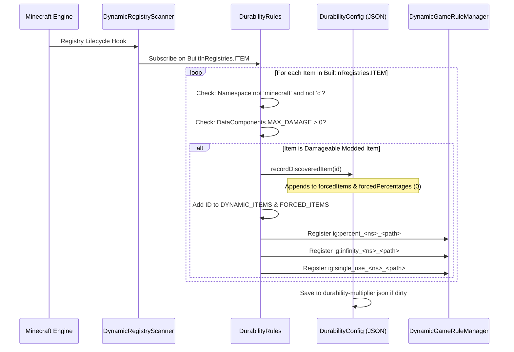

# Dynamic Modded Item Registration (26.1.2)

| System Parameter | Value |
| :--- | :--- |
| **Scanner Engine** | `DynamicRegistryScanner.subscribe(BuiltInRegistries.ITEM, ...)` |
| **Durability Condition** | `DataComponents.MAX_DAMAGE > 0` or entry in `forcedItems` |
| **Ignored Namespaces** | `minecraft`, `c` (handled via standard vanilla & convention categories) |
| **Dynamic Registry List** | `DurabilityRules.DYNAMIC_ITEMS` & `DurabilityRules.FORCED_ITEMS` |
| **Generated Percentage Key** | `ig:percent_<namespace>_<path>` (Min `-1`, Default `0`) |
| **Generated Infinity Key** | `ig:infinity_<namespace>_<path>` (Default `false`) |
| **Generated Single-Use Key** | `ig:single_use_<namespace>_<path>` (Default `false`) |
| **Auto-Populate Target** | `forcedItems` list & `forcedPercentages` map in `config/durability-multiplier.json` |

---

## ⚡ Overview & Purpose

Many Minecraft mods introduce custom weapons, magical wands, energy tools, or mechanical devices that do **not** extend standard vanilla item classes (`SwordItem`, `PickaxeItem`) or implement vanilla item tags (`#minecraft:swords`).

Durability Multiplier solves this through an autonomous **Dynamic Item Registration & Auto-Populate Engine**. Any damageable modded item is automatically detected, registered into the in-game GameRule system with full tab-autocomplete, and populated directly into `config/durability-multiplier.json` on startup.

---

## 🔧 Universal 3-Tier Discovery Scanner

The mod implements a 3-tier scanning lifecycle to ensure 100% item discovery regardless of when other mods register their items:



### 1. Tier 1: Startup Sweep
Immediately upon mod initialization (`DurabilityRules.register()`), the engine scans all explicitly declared items from `config/durability-multiplier.json` (`forcedItems`, `forcedPercentages`, `forcedInfinities`, `forcedSingleUses`) and registers their dynamic GameRules.

### 2. Tier 2: Live Entry Subscription
The mod subscribes to `BuiltInRegistries.ITEM` via `DynamicRegistryScanner`. Whenever an external mod registers a new item, the callback inspects the item:
* If the item namespace is not `minecraft` or `c`, and has `DataComponents.MAX_DAMAGE > 0`, it is marked as discovered.
* The item is recorded into `forcedItems` and `forcedPercentages` (default `0`).
* Dynamic GameRules are created immediately on the fly.

### 3. Tier 3: Server Start Safety Sweep
When a world loads or a server starts, a final safety pass guarantees that late-registered items from datapacks or late-loading mods are captured and synchronized.

---

## 📖 Step-by-Step How-To Guides

### How-To 1: Configuring Modded Items In-Game via `/gamerule` Commands

Every discovered modded item receives three dedicated GameRules:
1. `ig:percent_<namespace>_<path>`: Sets durability percentage (`100` = 1x vanilla, `200` = 2x, `50` = 0.5x, `0` = inherit parent/global, `-1` = single-use).
2. `ig:infinity_<namespace>_<path>`: Toggles unbreakable God Mode (`true` / `false`).
3. `ig:single_use_<namespace>_<path>`: Toggles 1-hit Glass Mode (`true` / `false`).

#### Example Commands:
```mcfunction
# 1. Query the current percentage for a custom plasma cutter
/gamerule ig:percent_techmod_plasma_cutter

# 2. Give the plasma cutter 500% (5x) durability in the active world
/gamerule ig:percent_techmod_plasma_cutter 500

# 3. Make a magic wand completely unbreakable (God Mode)
/gamerule ig:infinity_magicmod_staff_of_fire true

# 4. Make an obsidian dagger break after a single use (Glass Mode)
/gamerule ig:single_use_customweapons_obsidian_dagger true

# 5. Reset the plasma cutter to inherit global/category settings
/gamerule ig:percent_techmod_plasma_cutter 0
```

> 💡 **Instant Tab-Autocomplete**: Type `/gamerule ig:percent_` or `/gamerule ig:infinity_` and press `Tab` to see all discovered modded items autocompleted instantly!

---

### How-To 2: Pre-Configuring Modded Items in `durability-multiplier.json`

For modpack authors creating distributed packs or server owners setting default values for all future worlds:

1. Launch the game once with your mods installed so the auto-populator scans all items.
2. Open `config/durability-multiplier.json` in any text editor.
3. Locate the `forcedPercentages`, `forcedInfinities`, or `forcedSingleUses` maps.
4. Set your desired values:

```json
{
  "configVersion": 2,
  "percentGlobal": 200,
  
  "forcedItems": [
    "techmod:plasma_cutter",
    "magicmod:staff_of_fire",
    "survivalmod:flint_knife"
  ],
  
  "forcedPercentages": {
    "techmod:plasma_cutter": 400,
    "survivalmod:flint_knife": 50
  },
  
  "forcedInfinities": {
    "magicmod:staff_of_fire": true
  },
  
  "forcedSingleUses": {}
}
```

5. Save the file. Any new singleplayer world or freshly created server will use these baseline defaults.

---

### How-To 3: Using the Power-User `-1` Glass Mode Sentinel

Instead of toggling the boolean `ig:single_use_<mod>_<item>` rule, you can directly set `-1` on any percentage rule:

```mcfunction
# Set the plasma cutter to 1-hit break mode using the percentage rule
/gamerule ig:percent_techmod_plasma_cutter -1
```

* **Why it works**: The evaluation engine checks `getEffectivePercent(...) <= -1`. If true, `isSingleUse(...)` immediately returns `true`.
* **Advantage**: Allows setting single-use mechanics directly from numerical configuration inputs and slider interfaces.

