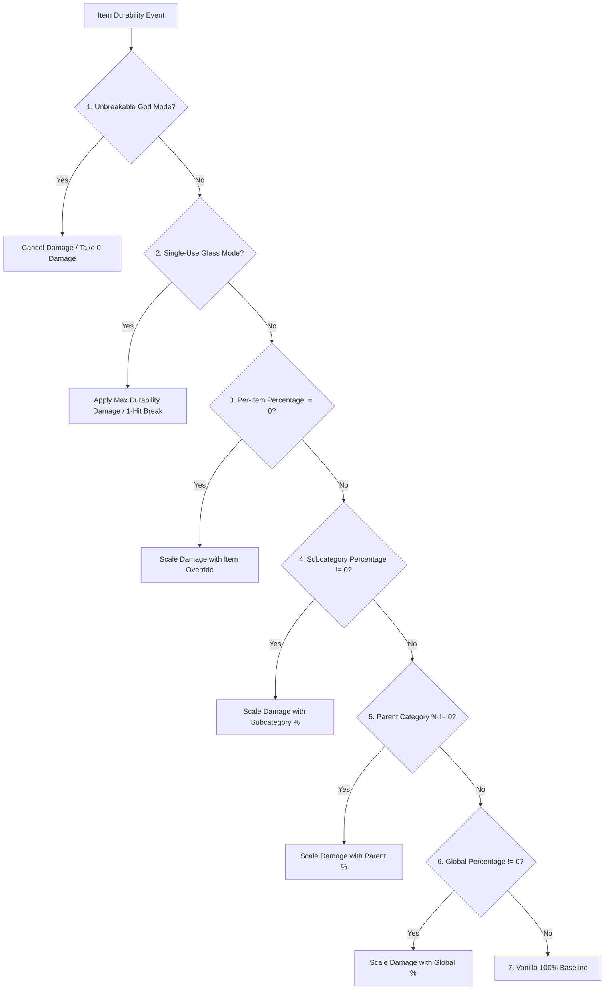

# Item Classification & Mod Compatibility (26.1.2)

| System Parameter | Value |
| :--- | :--- |
| **Classification Method** | `DurabilityHelper.classifyItem(ItemStack)` |
| **Caching Engine** | Thread-safe `ConcurrentHashMap<Item, ItemCategory>` |
| **Supported Categories** | 22 Distinct Categories & Fallbacks |
| **Component Inspection** | `DataComponents.MAX_DAMAGE`, `EQUIPPABLE`, `TOOL`, `GLIDER` |
| **Tag Inspection** | `#minecraft:*` and `#c:*` (Conventional / Fabric Tags) |
| **Durability Gate** | `DataComponents.MAX_DAMAGE > 0` (Blocks & Furniture strictly filtered) |

---

## 🔍 Strict Durability Filtering (`MAX_DAMAGE > 0`)

To prevent registry clutter and GameRules namespace pollution, Durability Multiplier enforces a strict durability prerequisite:

```java
public static boolean isItemDamageable(Item item) {
    if (item == null) return false;
    try {
        Identifier id = BuiltInRegistries.ITEM.getKey(item);
        if (id != null && (FORCED_ITEMS.contains(id) || DurabilityConfig.get().isForced(id.toString()))) {
            return true;
        }
        Integer maxDamage = item.components().get(DataComponents.MAX_DAMAGE);
        return maxDamage != null && maxDamage > 0;
    } catch (Throwable t) {
        return false;
    }
}
```

### Why Non-Damageable Modded Items Are Excluded
* **Furniture Mods** (e.g. Macaw's Furniture wardrobes, chairs, tables, doors): These items do not possess the `DataComponents.MAX_DAMAGE` component because they are placeable blocks, not wear-and-tear tools.
* **Building Blocks & Materials**: Stone, ingots, gems, wood, and decoration items are completely ignored by the scanner.
* **Food & Consumables**: Consumables have stack sizes $> 1$ and zero durability.
* **Performance Benefit**: Pre-filtering eliminates ~95% of game items during startup sweeps in $0.0001\mu\text{s}$, ensuring zero overhead and pristine autocomplete suggestions in commands.

---

## 👑 Complete Evaluation & Precedence Hierarchy

When an item undergoes durability calculation, `DurabilityHelper` executes the following strict 7-tier evaluation sequence:



### Priority Breakdown:
1. **Unbreakable God Mode (`isInfinite`)**:
   * Per-Item Override (`ig:infinity_<mod>_<item>` / `forcedInfinities`) $\rightarrow$ Subcategory (`ig:dm_infinity_pickaxes`) $\rightarrow$ Parent Category (`ig:dm_infinity_tools`) $\rightarrow$ Global (`ig:dm_infinity_global`).
2. **Single-Use Glass Mode (`isSingleUse`)**:
   * `-1` Sentinel in percentage rule $\rightarrow$ Per-Item (`ig:single_use_<mod>_<item>`) $\rightarrow$ Subcategory $\rightarrow$ Parent Category $\rightarrow$ Global.
3. **Per-Item Percentage Override**:
   * `ig:percent_<mod>_<item>` or `forcedPercentages` (if $\neq 0$).
4. **Specific Subcategory Percentage**:
   * `ig:dm_percent_swords`, `ig:dm_percent_pickaxes`, `ig:dm_percent_helmets`, etc. (if $\neq 0$).
5. **Parent Category Percentage**:
   * Tools parent (`ig:dm_percent_tools`), Weapons parent (`ig:dm_percent_weapons`), Armor parent (`ig:dm_percent_armor`) (if $\neq 0$).
6. **Global Percentage**:
   * `ig:dm_percent_global` (if $\neq 0$).
7. **Vanilla Baseline**:
   * Default $100\%$ ($1\times$ vanilla durability).

---

## 📦 Category Match Criteria & Supported Items

### 1. Weapons
* **Swords (`ItemCategory.SWORD`)**: `#minecraft:swords`, `#c:swords`, `#c:melee_weapons`, `SwordItem`.
* **Spears (`ItemCategory.SPEAR`)**: `#minecraft:spears`, `#c:spears`.
* **Tridents (`ItemCategory.TRIDENT`)**: `Items.TRIDENT`, `#c:tridents`, `TridentItem`.
* **Maces (`ItemCategory.MACE`)**: `Items.MACE`, `#c:maces`, `MaceItem`.
* **Bows (`ItemCategory.BOW`)**: `Items.BOW`, `#c:bows`, `BowItem`.
* **Crossbows (`ItemCategory.CROSSBOW`)**: `Items.CROSSBOW`, `#c:crossbows`, `CrossbowItem`.
* **Shields (`ItemCategory.SHIELD`)**: `Items.SHIELD`, `#c:shields`, `ShieldItem`.

### 2. Tools & Utility
* **Pickaxes (`ItemCategory.PICKAXE`)**: `#minecraft:pickaxes`, `#c:pickaxes`, `PickaxeItem`.
* **Axes (`ItemCategory.AXE`)**: `#minecraft:axes`, `#c:axes`, `AxeItem`.
* **Shovels (`ItemCategory.SHOVEL`)**: `#minecraft:shovels`, `#c:shovels`, `ShovelItem`.
* **Hoes (`ItemCategory.HOE`)**: `#minecraft:hoes`, `#c:hoes`, `HoeItem`.
* **Shears (`ItemCategory.SHEARS`)**: `Items.SHEARS`, `#c:shears`, `ShearsItem`.
* **Fishing Rods (`ItemCategory.FISHING_ROD`)**: `Items.FISHING_ROD`, `FishingRodItem`.
* **Brushes (`ItemCategory.BRUSH`)**: `Items.BRUSH`, `BrushItem`.
* **Flint and Steel (`ItemCategory.FLINT_AND_STEEL`)**: `Items.FLINT_AND_STEEL`, `FlintAndSteelItem`.
* **Tool Global (`ItemCategory.TOOL_GLOBAL`)**: Any remaining item with `DataComponents.TOOL` or `#c:tools`.

### 3. Armor & Wearables
* **Helmets (`ItemCategory.HELMET`)**: `#minecraft:head_armor`, `#c:helmets`, `Equippable` (HEAD).
* **Chestplates (`ItemCategory.CHESTPLATE`)**: `#minecraft:chest_armor`, `#c:chestplates`, `Equippable` (CHEST).
* **Leggings (`ItemCategory.LEGGINGS`)**: `#minecraft:leg_armor`, `#c:leggings`, `Equippable` (LEGS).
* **Boots (`ItemCategory.BOOTS`)**: `#minecraft:foot_armor`, `#c:boots`, `Equippable` (FEET).
* **Elytra (`ItemCategory.ELYTRA`)**: `Items.ELYTRA`, `DataComponents.GLIDER`.

### 4. Other / Modded Items (`ItemCategory.OTHER`)
* Any damageable item that does not match standard tags or components is assigned to `OTHER` and managed dynamically via the [[Dynamic Scanner|26.1.2-Dynamic-Modded-Item-Registration]].

