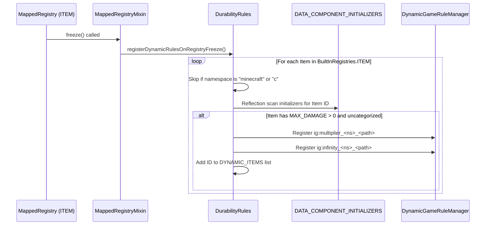

# Dynamic Modded Item Registration (26.1.2)

| System Parameter | Value |
| :--- | :--- |
| **Trigger Point** | `MappedRegistry.freeze()` (`Registries.ITEM`) |
| **Mixin Hook** | `MappedRegistryMixin` |
| **Scanner Class** | `DurabilityRules.registerDynamicRulesOnRegistryFreeze()` |
| **Reflection Target** | `BuiltInRegistries.DATA_COMPONENT_INITIALIZERS` |
| **Dynamic Item List** | `DurabilityRules.DYNAMIC_ITEMS` |
| **Generated Multiplier Key** | `ig:multiplier_<namespace>_<path>` |
| **Generated Infinity Key** | `ig:infinity_<namespace>_<path>` |

---

## ⚡ Overview & Purpose

Many Minecraft mods introduce custom weapons, magical wands, energy tools, or mechanical devices that do **not** use standard vanilla item classes (`PickaxeItem`, `SwordItem`) or tags (`#minecraft:swords`).

Durability Multiplier automatically detects these items and dynamically generates dedicated GameRules for each uncategorized modded item at server startup, allowing full multiplier and God Mode configuration.

---

## 🔧 How the Scanner Works

### Reflection-Based Initializer Inspection
To avoid triggering early component binding errors or `NullPointerException: Components not bound yet` during mod initialization, `DurabilityRules` inspects `BuiltInRegistries.DATA_COMPONENT_INITIALIZERS` using reflection:
1. Accesses `initializers` list in `DATA_COMPONENT_INITIALIZERS`.
2. Locates matching `ResourceKey<Item>`.
3. Runs the initializer against an isolated `DataComponentMap.Builder`.
4. Checks if `DataComponents.MAX_DAMAGE` is present and $> 0$.
5. Confirms the item does not have `DataComponents.TOOL` or `DataComponents.EQUIPPABLE` (which are already handled in standard categories).

---

## 🎮 In-Game Usage of Dynamic Rules

When an uncategorized modded item (e.g. `techmod:plasma_cutter`) is detected:
* Multiplier Rule registered: `/gamerule ig:multiplier_techmod_plasma_cutter <value>`
* God Mode Rule registered: `/gamerule ig:infinity_techmod_plasma_cutter <true|false>`
* The Cloth Config / ModMenu configuration screen automatically populates these under the **Modded Items** tab.
