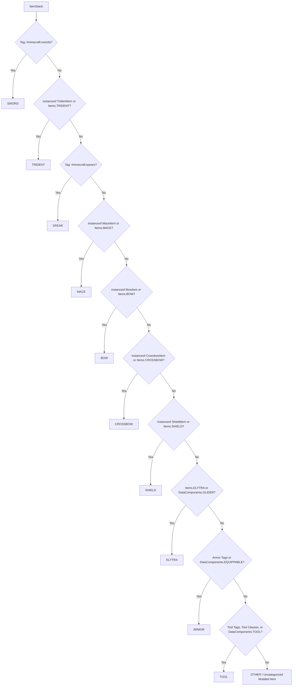

# Item Classification & Mod Compatibility (26.2)

| System Parameter | Value |
| :--- | :--- |
| **Classification Method** | `DurabilityHelper.classifyItem(ItemStack)` |
| **Caching Engine** | Thread-safe `ConcurrentHashMap<Item, ItemCategory>` |
| **Supported Categories** | 12 Enum Types |
| **Component Inspection** | `DataComponents.EQUIPPABLE`, `TOOL`, `GLIDER` |
| **Tag Inspection** | `#minecraft:swords`, `#minecraft:spears`, `#minecraft:axes`, etc. |

---

## 🔍 Classification Algorithm

To ensure zero tick lag during high-frequency combat and block-breaking loops, item classification is cached in `CATEGORY_CACHE` and resolved through strict prioritized rules:

---

## 📦 Category Match Criteria

### 1. Swords (`ItemCategory.SWORD`)
* Matches items tagged in `#minecraft:swords`.
* Includes all vanilla swords (Wood, Stone, Iron, Gold, Diamond, Netherite) and any modded swords implementing the standard tag.

### 2. Spears (`ItemCategory.SPEAR`)
* Matches items tagged in `#minecraft:spears`.

### 3. Tridents (`ItemCategory.TRIDENT`)
* Matches `Items.TRIDENT` or any class extending `TridentItem`.

### 4. Maces (`ItemCategory.MACE`)
* Matches `Items.MACE` or any class extending `MaceItem`.

### 5. Bows (`ItemCategory.BOW`)
* Matches `Items.BOW` or any class extending `BowItem`.

### 6. Crossbows (`ItemCategory.CROSSBOW`)
* Matches `Items.CROSSBOW` or any class extending `CrossbowItem`.

### 7. Shields (`ItemCategory.SHIELD`)
* Matches `Items.SHIELD` or any class extending `ShieldItem`.

### 8. Elytra (`ItemCategory.ELYTRA`)
* Matches `Items.ELYTRA` or any item stack possessing the `DataComponents.GLIDER` component.

### 9. Armor (`ItemCategory.ARMOR`)
* Matches tags `#minecraft:head_armor`, `#minecraft:chest_armor`, `#minecraft:leg_armor`, `#minecraft:foot_armor`.
* Matches any item stack with `DataComponents.EQUIPPABLE` whose slot is `HEAD`, `CHEST`, `LEGS`, or `FEET`.

### 10. Tools (`ItemCategory.TOOL`)
* Matches tags `#minecraft:axes`, `#minecraft:pickaxes`, `#minecraft:shovels`, `#minecraft:hoes`.
* Matches `Items.SHEARS`, `Items.FISHING_ROD`, `Items.FLINT_AND_STEEL`, `Items.BRUSH`, `Items.CARROT_ON_A_STICK`, `Items.WARPED_FUNGUS_ON_A_STICK`.
* Matches class instances of `AxeItem`, `HoeItem`, `ShovelItem`, `ShearsItem`, `FishingRodItem`, `FlintAndSteelItem`, `BrushItem`, `FoodOnAStickItem`.
* Matches any item stack with the `DataComponents.TOOL` component.

### 11. Other (`ItemCategory.OTHER`)
* Any damageable item that does not match the above categories is classified as `OTHER` and handled by the [[Dynamic Modded Item System|Dynamic-Modded-Item-Registration]].
