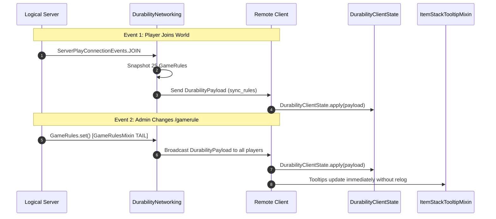

# Network Sync & Payload Protocol (26.1.2)

| Protocol Parameter | Value |
| :--- | :--- |
| **Channel Identifier** | `durability-multiplier:sync_rules` |
| **Payload Class** | `net.instantgratification.durabilitymultiplier.network.DurabilityPayload` |
| **Network Manager** | `net.instantgratification.durabilitymultiplier.network.DurabilityNetworking` |
| **Client State Cache** | `net.instantgratification.durabilitymultiplier.network.DurabilityClientState` |
| **Codec Type** | `StreamCodec<FriendlyByteBuf, DurabilityPayload>` |
| **Sync Triggers** | Player Join (`ServerPlayConnectionEvents.JOIN`) & GameRule Change (`GameRulesMixin`) |

---

## ⚡ Protocol Architecture

Because tooltips are rendered on the physical client but GameRules exist on the logical server, Durability Multiplier uses Fabric Networking API to push live snapshots of all 25 GameRules to clients.



---

## 📦 Payload Structure (25 Fields)

`DurabilityPayload` serializes 25 fields efficiently using `FriendlyByteBuf` VarInts and Booleans:

```java
public record DurabilityPayload(
    int multiplierGlobal,
    int multiplierWeapons,
    int multiplierSwords,
    int multiplierSpears,
    int multiplierTridents,
    int multiplierMaces,
    int multiplierBows,
    int multiplierCrossbows,
    int multiplierShields,
    int multiplierTools,
    int multiplierArmor,
    int multiplierElytra,
    
    boolean infinityGlobal,
    boolean infinityWeapons,
    boolean infinitySwords,
    boolean infinitySpears,
    boolean infinityTridents,
    boolean infinityMaces,
    boolean infinityBows,
    boolean infinityCrossbows,
    boolean infinityShields,
    boolean infinityTools,
    boolean infinityArmor,
    boolean infinityElytra,
    
    boolean showTooltip
) implements CustomPacketPayload
```
