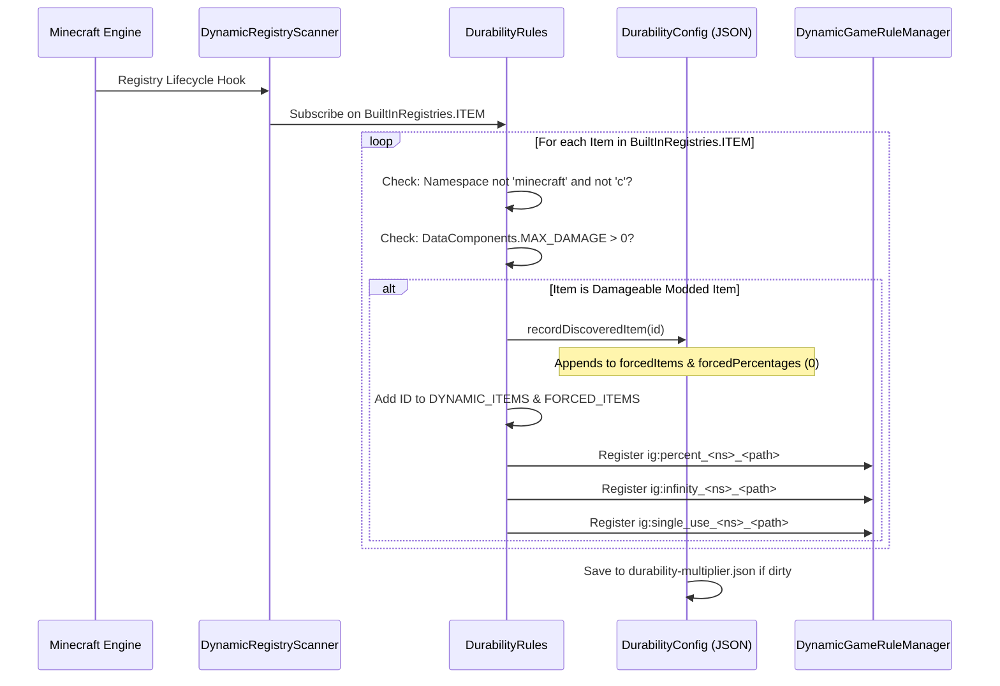

# Dynamische Mod-Gegenstandsregistrierung (26.2)

| Systemparameter | Wert |
| :--- | :--- |
| **Scanner-Engine** | `DynamicRegistryScanner.subscribe(BuiltInRegistries.ITEM, ...)` |
| **Haltbarkeitsbedingung** | `DataComponents.MAX_DAMAGE > 0` oder Eintrag in `forcedItems` |
| **Ignorierte Namespaces** | `minecraft`, `c` (über Vanilla- & Standard-Kategorien abgedeckt) |
| **Dynamische Registrierungsliste** | `DurabilityRules.DYNAMIC_ITEMS` & `DurabilityRules.FORCED_ITEMS` |
| **Generierter Prozent-Schlüssel** | `ig:percent_<namespace>_<path>` (Min `-1`, Standard `0`) |
| **Generierter Gott-Modus-Schlüssel** | `ig:infinity_<namespace>_<path>` (Standard `false`) |
| **Generierter Einmal-Gebrauch-Schlüssel** | `ig:single_use_<namespace>_<path>` (Standard `false`) |
| **Auto-Populate-Ziel** | `forcedItems`-Liste & `forcedPercentages`-Map in `config/durability-multiplier.json` |

---

## ⚡ Übersicht & Zweck

Viele Minecraft-Mods führen eigene Waffen, Zauberstäbe, Energiewerkzeuge oder Mechanismen ein, die **nicht** von Vanilla-Klassen (`SwordItem`, `PickaxeItem`) erben oder Vanilla-Tags (`#minecraft:swords`) nutzen.

Durability Multiplier löst dies durch eine autonome **Dynamische Gegenstandsregistrierung & Auto-Populate-Engine**. Jeder Mod-Gegenstand mit Haltbarkeit wird automatisch erkannt, mit Tab-Vervollständigung in GameRules registriert und beim Start in `config/durability-multiplier.json` eingetragen.

---

## 🔧 Universeller 3-Stufen-Erkennungsscanner

Die Mod implementiert einen 3-Stufen-Scan-Lebenszyklus, um eine 100%ige Erkennung sicherzustellen, unabhängig vom Ladezeitpunkt anderer Mods:



### 1. Stufe 1: Start-Scan
Direkt bei der Mod-Initialisierung (`DurabilityRules.register()`) scannt die Engine alle explizit deklarierten Gegenstände aus `config/durability-multiplier.json` und registriert deren dynamische GameRules.

### 2. Stufe 2: Live-Eintragsabonnement
Die Mod abonniert `BuiltInRegistries.ITEM` über `DynamicRegistryScanner`. Wann immer eine externe Mod einen Gegenstand registriert, prüft der Callback den Gegenstand:
* Wenn der Namespace nicht `minecraft` oder `c` ist und `DataComponents.MAX_DAMAGE > 0` gilt, wird er als erkannt markiert.
* Der Gegenstand wird in `forcedItems` und `forcedPercentages` (Standard `0`) eingetragen.
* Dynamische GameRules werden sofort in Echtzeit erstellt.

### 3. Stufe 3: Sicherheits-Scan beim Serverstart
Beim Laden einer Welt oder Serverstart stellt ein finaler Sicherheitsdurchlauf sicher, dass spät registrierte Gegenstände synchronisiert werden.

---

## 📖 Schritt-für-Schritt-Anleitungen

### Anleitung 1: Mod-Gegenstände im Spiel über `/gamerule`-Befehle konfigurieren

Jeder erkannte Mod-Gegenstand erhält drei dedizierte GameRules:
1. `ig:percent_<namespace>_<path>`: Bestimmt die Haltbarkeit (`100` = 1x vanilla, `200` = 2x, `50` = 0.5x, `0` = erben, `-1` = Einmal-Gebrauch).
2. `ig:infinity_<namespace>_<path>`: Schaltet den unzerstörbaren Gott-Modus um (`true` / `false`).
3. `ig:single_use_<namespace>_<path>`: Schaltet den 1-Schlag-Glas-Modus um (`true` / `false`).

#### Beispielbefehle:
```mcfunction
# 1. Query the current percentage for a custom plasma cutter
/gamerule ig:percent_techmod_plasma_cutter

# 2. Give the plasma cutter 500% (5x) durability in the active world
/gamerule ig:percent_techmod_plasma_cutter 500

# 3. Make a magic wand completely unbreakable (God Mode)
/gamerule ig:infinity_magicmod_staff_of_fire true

# 4. Make an obsidian dagger break after a single use (Glass Mode)
/gamerule ig:single_use_customweapons_obsidian_dagger true

# 5. Reset the plasma cutter to inherit global/category settings
/gamerule ig:percent_techmod_plasma_cutter 0
```

> 💡 **Sofortige Tab-Vervollständigung**: Gib `/gamerule ig:percent_` oder `/gamerule ig:infinity_` ein und drücke `Tab`, um alle Gegenstände zu sehen!

---

### Anleitung 2: Vorkonfiguration von Mod-Gegenständen in `durability-multiplier.json`

Für Modpack-Ersteller und Server-Betreiber, die Standards für zukünftige Welten festlegen möchten:

1. Starte das Spiel einmal mit installierten Mods, damit der Scanner alle Gegenstände erfasst.
2. Öffne `config/durability-multiplier.json` in einem Texteditor.
3. Finde die Abschnitte `forcedPercentages`, `forcedInfinities` oder `forcedSingleUses`.
4. Trage die gewünschten Werte ein:

```json
{
  "configVersion": 2,
  "percentGlobal": 200,
  
  "forcedItems": [
    "techmod:plasma_cutter",
    "magicmod:staff_of_fire",
    "survivalmod:flint_knife"
  ],
  
  "forcedPercentages": {
    "techmod:plasma_cutter": 400,
    "survivalmod:flint_knife": 50
  },
  
  "forcedInfinities": {
    "magicmod:staff_of_fire": true
  },
  
  "forcedSingleUses": {}
}
```

5. Speichere die Datei. Jede neue Welt nutzt nun diese Standardwerte.

---

### Anleitung 3: Verwendung des Power-User `-1` Glas-Modus-Sentinels

Statt der booleschen Regel `ig:single_use_<mod>_<item>` kannst du direkt `-1` bei jeder Prozentregel setzen:

```mcfunction
# Set the plasma cutter to 1-hit break mode using the percentage rule
/gamerule ig:percent_techmod_plasma_cutter -1
```

* **Warum es funktioniert**: Die Engine prüft `getEffectivePercent(...) <= -1`. Wenn wahr, gibt `isSingleUse(...)` sofort `true` zurück.
* **Vorteil**: Ermöglicht die Einstellung von Einmal-Mechaniken direkt über numerische Eingaben und Schieberegler.

