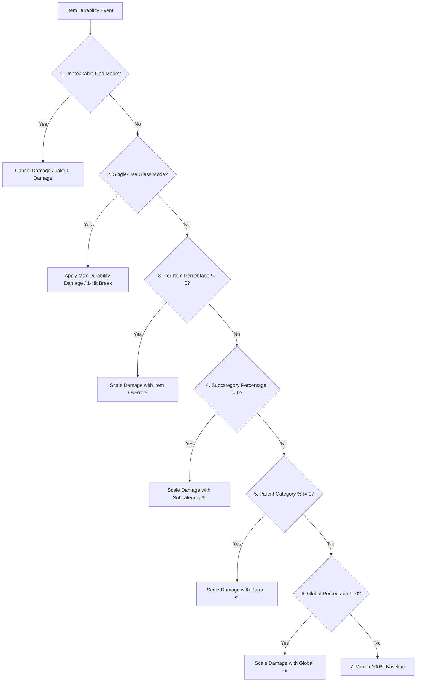

# Clasificación de objetos y compatibilidad con mods (26.1.2)

| Parámetro del sistema | Valor |
| :--- | :--- |
| **Método de clasificación** | `DurabilityHelper.classifyItem(ItemStack)` |
| **Motor de caché** | `ConcurrentHashMap<Item, ItemCategory>` seguro para subprocesos |
| **Categorías admitidas** | 22 categorías distintas y respaldos |
| **Inspección de componentes** | `DataComponents.MAX_DAMAGE`, `EQUIPPABLE`, `TOOL`, `GLIDER` |
| **Inspección de etiquetas** | `#minecraft:*` y `#c:*` (Etiquetas convencionales / Fabric) |
| **Filtro de durabilidad** | `DataComponents.MAX_DAMAGE > 0` (Bloques y muebles estrictamente filtrados) |

---

## 🔍 Filtrado estricto de durabilidad (`MAX_DAMAGE > 0`)

Para evitar desorden en el registro y saturación del espacio de nombres de GameRules, Durability Multiplier impone un requisito estricto:

```java
public static boolean isItemDamageable(Item item) {
    if (item == null) return false;
    try {
        Identifier id = BuiltInRegistries.ITEM.getKey(item);
        if (id != null && (FORCED_ITEMS.contains(id) || DurabilityConfig.get().isForced(id.toString()))) {
            return true;
        }
        Integer maxDamage = item.components().get(DataComponents.MAX_DAMAGE);
        return maxDamage != null && maxDamage > 0;
    } catch (Throwable t) {
        return false;
    }
}
```

### Por qué se excluyen los objetos de mods que no se dañan
* **Mods de muebles** (ej. armarios, sillas, mesas, puertas de Macaw's Furniture): Estos objetos no poseen el componente `DataComponents.MAX_DAMAGE` porque son bloques colocables, no herramientas de desgaste.
* **Bloques de construcción y materiales**: Piedra, lingotes, gemas, madera y objetos decorativos son ignorados por completo por el escáner.
* **Comida y consumibles**: Los consumibles tienen tamaños de acumulación $> 1$ y cero durabilidad.
* **Beneficio de rendimiento**: El prefiltrado elimina ~95% de los objetos en $0.0001\mu\text{s}$ durante el inicio, asegurando cero sobrecarga.

---

## 👑 Jerarquía completa de evaluación y prioridad

Cuando un objeto pasa por el cálculo de durabilidad, `DurabilityHelper` ejecuta la siguiente secuencia estricta de evaluación de 7 niveles:



### Desglose de prioridades:
1. **Modo Dios Irrompible (`isInfinite`)**:
   * Per-Item Override (`ig:infinity_<mod>_<item>` / `forcedInfinities`) $\rightarrow$ Subcategory (`ig:dm_infinity_pickaxes`) $\rightarrow$ Parent Category (`ig:dm_infinity_tools`) $\rightarrow$ Global (`ig:dm_infinity_global`).
2. **Modo Cristal de Un solo uso (`isSingleUse`)**:
   * `-1` Sentinel in percentage rule $\rightarrow$ Per-Item (`ig:single_use_<mod>_<item>`) $\rightarrow$ Subcategory $\rightarrow$ Parent Category $\rightarrow$ Global.
3. **Anulación de porcentaje por objeto**:
   * `ig:percent_<mod>_<item>` or `forcedPercentages` (if $\neq 0$).
4. **Porcentaje de subcategoría específica**:
   * `ig:dm_percent_swords`, `ig:dm_percent_pickaxes`, `ig:dm_percent_helmets`, etc. (if $\neq 0$).
5. **Porcentaje de categoría padre**:
   * Tools parent (`ig:dm_percent_tools`), Weapons parent (`ig:dm_percent_weapons`), Armor parent (`ig:dm_percent_armor`) (if $\neq 0$).
6. **Porcentaje global**:
   * `ig:dm_percent_global` (if $\neq 0$).
7. **Base vanilla**:
   * Default $100\%$ ($1\times$ vanilla durability).

---

## 📦 Criterios de coincidencia de categorías y objetos compatibles

### 1. Armas
* **Espadas (`ItemCategory.SWORD`)**: `#minecraft:swords`, `#c:swords`, `#c:melee_weapons`, `SwordItem`.
* **Lanzas (`ItemCategory.SPEAR`)**: `#minecraft:spears`, `#c:spears`.
* **Tridentes (`ItemCategory.TRIDENT`)**: `Items.TRIDENT`, `#c:tridents`, `TridentItem`.
* **Mazas (`ItemCategory.MACE`)**: `Items.MACE`, `#c:maces`, `MaceItem`.
* **Arcos (`ItemCategory.BOW`)**: `Items.BOW`, `#c:bows`, `BowItem`.
* **Ballestas (`ItemCategory.CROSSBOW`)**: `Items.CROSSBOW`, `#c:crossbows`, `CrossbowItem`.
* **Escudos (`ItemCategory.SHIELD`)**: `Items.SHIELD`, `#c:shields`, `ShieldItem`.

### 2. Herramientas y utilidades
* **Picos (`ItemCategory.PICKAXE`)**: `#minecraft:pickaxes`, `#c:pickaxes`, `PickaxeItem`.
* **Hachas (`ItemCategory.AXE`)**: `#minecraft:axes`, `#c:axes`, `AxeItem`.
* **Palas (`ItemCategory.SHOVEL`)**: `#minecraft:shovels`, `#c:shovels`, `ShovelItem`.
* **Azadas (`ItemCategory.HOE`)**: `#minecraft:hoes`, `#c:hoes`, `HoeItem`.
* **Tijeras (`ItemCategory.SHEARS`)**: `Items.SHEARS`, `#c:shears`, `ShearsItem`.
* **Cañas de pescar (`ItemCategory.FISHING_ROD`)**: `Items.FISHING_ROD`, `FishingRodItem`.
* **Pinceles (`ItemCategory.BRUSH`)**: `Items.BRUSH`, `BrushItem`.
* **Mecheros (`ItemCategory.FLINT_AND_STEEL`)**: `Items.FLINT_AND_STEEL`, `FlintAndSteelItem`.
* **Herramientas globales (`ItemCategory.TOOL_GLOBAL`)**: Cualquier objeto restante con `DataComponents.TOOL` o `#c:tools`.

### 3. Armaduras y prendas
* **Cascos (`ItemCategory.HELMET`)**: `#minecraft:head_armor`, `#c:helmets`, `Equippable` (CABEZA).
* **Petos (`ItemCategory.CHESTPLATE`)**: `#minecraft:chest_armor`, `#c:chestplates`, `Equippable` (PECHO).
* **Pantalones (`ItemCategory.LEGGINGS`)**: `#minecraft:leg_armor`, `#c:leggings`, `Equippable` (PIERNAS).
* **Botas (`ItemCategory.BOOTS`)**: `#minecraft:foot_armor`, `#c:boots`, `Equippable` (PIES).
* **Élitros (`ItemCategory.ELYTRA`)**: `Items.ELYTRA`, `DataComponents.GLIDER`.

### 4. Otros objetos / objetos de mods (`ItemCategory.OTHER`)
* Cualquier objeto con durabilidad que no coincida con las etiquetas estándar se asigna a `OTHER` y se gestiona dinámicamente mediante el [[Escáner dinámico|es_es-26.1.2-Dynamic-Modded-Item-Registration]].

