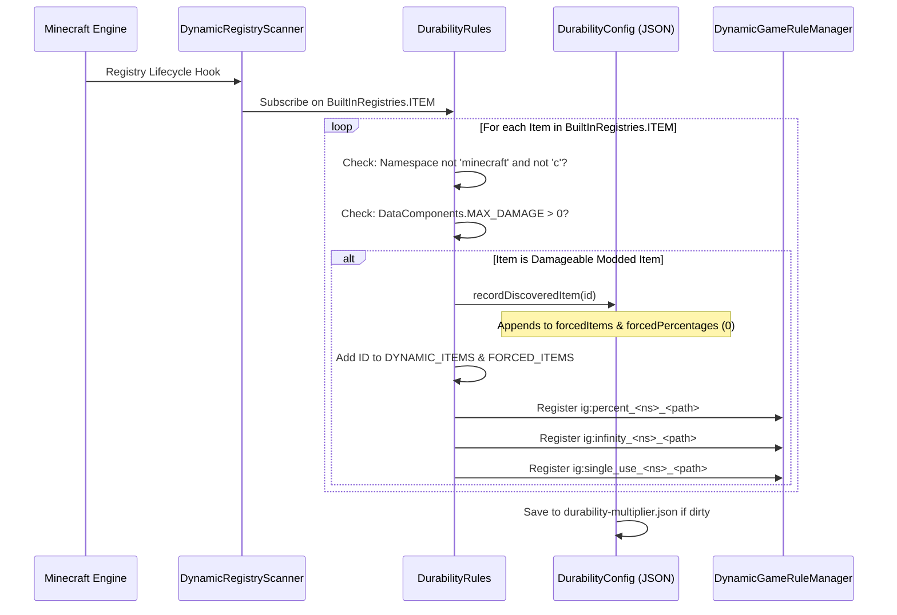

# Registro dinámico de objetos de mods (26.2)

| Parámetro del sistema | Valor |
| :--- | :--- |
| **Motor de escaneo** | `DynamicRegistryScanner.subscribe(BuiltInRegistries.ITEM, ...)` |
| **Condición de durabilidad** | `DataComponents.MAX_DAMAGE > 0` o entrada en `forcedItems` |
| **Espacios de nombres ignorados** | `minecraft`, `c` (manejados mediante categorías estándar de vanilla y convenciones) |
| **Lista de registro dinámico** | `DurabilityRules.DYNAMIC_ITEMS` y `DurabilityRules.FORCED_ITEMS` |
| **Clave de porcentaje generada** | `ig:percent_<namespace>_<path>` (Mín `-1`, Predeterminado `0`) |
| **Clave de Modo Dios generada** | `ig:infinity_<namespace>_<path>` (Predeterminado `false`) |
| **Clave de Un solo uso generada** | `ig:single_use_<namespace>_<path>` (Predeterminado `false`) |
| **Destino de autopoblado** | Lista `forcedItems` y mapa `forcedPercentages` en `config/durability-multiplier.json` |

---

## ⚡ Descripción general y propósito

Muchos mods de Minecraft introducen armas personalizadas, varitas mágicas, herramientas de energía o dispositivos mecánicos que **no** extienden las clases de objetos estándar de vanilla (`SwordItem`, `PickaxeItem`) ni implementan etiquetas vanilla (`#minecraft:swords`).

Durability Multiplier resuelve esto mediante un **Motor autónomo de registro dinámico y autopoblado de objetos**. Cualquier objeto de mod con durabilidad se detecta automáticamente, se registra en el sistema de GameRules con autocompletado por Tab y se guarda en `config/durability-multiplier.json` al iniciar.

---

## 🔧 Escáner de detección universal de 3 niveles

El mod implementa un ciclo de vida de escaneo de 3 niveles para garantizar el 100% de descubrimiento de objetos sin importar cuándo se registren otros mods:



### 1. Nivel 1: Escaneo al iniciar
Inmediatamente tras la inicialización del mod (`DurabilityRules.register()`), el motor escanea todos los objetos declarados explícitamente en `config/durability-multiplier.json` y registra sus GameRules dinámicas.

### 2. Nivel 2: Suscripción a entradas en vivo
El mod se suscribe a `BuiltInRegistries.ITEM` mediante `DynamicRegistryScanner`. Cada vez que un mod externo registra un objeto, la llamada examina el objeto:
* Si el espacio de nombres no es `minecraft` ni `c`, y tiene `DataComponents.MAX_DAMAGE > 0`, se marca como descubierto.
* El objeto se registra en `forcedItems` y `forcedPercentages` (predeterminado `0`).
* Las GameRules dinámicas se crean inmediatamente sobre la marcha.

### 3. Nivel 3: Escaneo de seguridad al iniciar el servidor
Cuando se carga un mundo o se inicia un servidor, una pasada final de seguridad garantiza que los objetos tardíos de datapacks o mods se sincronicen.

---

## 📖 Guías paso a paso

### Guía 1: Configuración de objetos de mods en el juego mediante comandos `/gamerule`

Cada objeto descubierto de mods recibe tres GameRules dedicadas:
1. `ig:percent_<namespace>_<path>`: Establece el porcentaje de durabilidad (`100` = 1x vanilla, `200` = 2x, `50` = 0.5x, `0` = hereda, `-1` = un solo uso).
2. `ig:infinity_<namespace>_<path>`: Alterna el Modo Dios irrompible (`true` / `false`).
3. `ig:single_use_<namespace>_<path>`: Alterna el Modo Cristal de 1 golpe (`true` / `false`).

#### Comandos de ejemplo:
```mcfunction
# 1. Query the current percentage for a custom plasma cutter
/gamerule ig:percent_techmod_plasma_cutter

# 2. Give the plasma cutter 500% (5x) durability in the active world
/gamerule ig:percent_techmod_plasma_cutter 500

# 3. Make a magic wand completely unbreakable (God Mode)
/gamerule ig:infinity_magicmod_staff_of_fire true

# 4. Make an obsidian dagger break after a single use (Glass Mode)
/gamerule ig:single_use_customweapons_obsidian_dagger true

# 5. Reset the plasma cutter to inherit global/category settings
/gamerule ig:percent_techmod_plasma_cutter 0
```

> 💡 **Autocompletado con Tab instantáneo**: ¡Escribe `/gamerule ig:percent_` o `/gamerule ig:infinity_` y presiona `Tab` para ver los objetos descubiertos!

---

### Guía 2: Preconfiguración de objetos de mods en `durability-multiplier.json`

Para creadores de modpacks que distribuyen paquetes o dueños de servidores que establecen valores por defecto:

1. Inicia el juego una vez con tus mods instalados para que el autopoblador escanee todos los objetos.
2. Abre `config/durability-multiplier.json` en cualquier editor de texto.
3. Localiza los mapas `forcedPercentages`, `forcedInfinities` o `forcedSingleUses`.
4. Establece los valores que desees:

```json
{
  "configVersion": 2,
  "percentGlobal": 200,
  
  "forcedItems": [
    "techmod:plasma_cutter",
    "magicmod:staff_of_fire",
    "survivalmod:flint_knife"
  ],
  
  "forcedPercentages": {
    "techmod:plasma_cutter": 400,
    "survivalmod:flint_knife": 50
  },
  
  "forcedInfinities": {
    "magicmod:staff_of_fire": true
  },
  
  "forcedSingleUses": {}
}
```

5. Guarda el archivo. Cualquier mundo nuevo o servidor recién creado utilizará estos valores predeterminados.

---

### Guía 3: Uso del centinela de modo de cristal `-1` para usuarios avanzados

En lugar de alternar la regla booleana `ig:single_use_<mod>_<item>`, puedes establecer directamente `-1` en cualquier regla de porcentaje:

```mcfunction
# Set the plasma cutter to 1-hit break mode using the percentage rule
/gamerule ig:percent_techmod_plasma_cutter -1
```

* **Por qué funciona**: El motor evalúa `getEffectivePercent(...) <= -1`. Si es true, `isSingleUse(...)` devuelve inmediatamente `true`.
* **Ventaja**: Permite configurar mecánicas de un solo uso directamente desde entradas numéricas y controles deslizantes.

