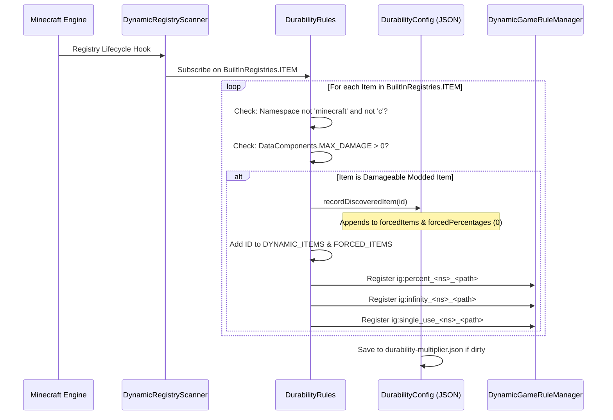

# Enregistrement dynamique d'objets de mods (26.2)

| Paramètre système | Valeur |
| :--- | :--- |
| **Moteur du scanner** | `DynamicRegistryScanner.subscribe(BuiltInRegistries.ITEM, ...)` |
| **Condition de durabilité** | `DataComponents.MAX_DAMAGE > 0` ou entrée dans `forcedItems` |
| **Espaces de noms ignorés** | `minecraft`, `c` (gérés via les catégories standard) |
| **Liste de registre dynamique** | `DurabilityRules.DYNAMIC_ITEMS` & `DurabilityRules.FORCED_ITEMS` |
| **Clé de pourcentage générée** | `ig:percent_<namespace>_<path>` (Min `-1`, Défaut `0`) |
| **Clé de Mode Dieu générée** | `ig:infinity_<namespace>_<path>` (Défaut `false`) |
| **Clé d'Usage unique générée** | `ig:single_use_<namespace>_<path>` (Défaut `false`) |
| **Cible de remplissage automatique** | Liste `forcedItems` & table `forcedPercentages` dans `config/durability-multiplier.json` |

---

## ⚡ Aperçu et objectif

De nombreux mods Minecraft ajoutent des armes, baguettes magiques ou outils énergétiques qui **n'étendent pas** les classes d'objets standard (`SwordItem`, `PickaxeItem`) et n'ont pas les tags vanilla (`#minecraft:swords`).

Durability Multiplier résout cela grâce à un **Moteur autonome d'enregistrement dynamique et de remplissage automatique**. Tout objet de mod avec durabilité est détecté, enregistré dans les GameRules avec autocomplétion par Tab et consigné dans `config/durability-multiplier.json` au démarrage.

---

## 🔧 Scanner universel de découverte à 3 niveaux

Le mod implémente un cycle de scan à 3 niveaux pour garantir 100% de détection, quel que soit le moment où les autres mods s'enregistrent :



### 1. Niveau 1 : Analyse au démarrage
Dès l'initialisation du mod (`DurabilityRules.register()`), le moteur analyse les objets déclarés dans `config/durability-multiplier.json` et enregistre leurs GameRules dynamiques.

### 2. Niveau 2 : Souscription aux entrées en direct
Le mod s'abonne à `BuiltInRegistries.ITEM` via `DynamicRegistryScanner`. Chaque fois qu'un mod externe enregistre un objet, le callback l'examine :
* Si l'espace de noms n'est pas `minecraft`/`c` et a `DataComponents.MAX_DAMAGE > 0`, il est marqué comme découvert.
* L'objet est enregistré dans `forcedItems` et `forcedPercentages` (défaut `0`).
* Les GameRules dynamiques sont créées immédiatement à la volée.

### 3. Niveau 3 : Analyse de sécurité au démarrage du serveur
Au chargement du monde ou au démarrage du serveur, une passe finale garantit que les objets tardifs sont capturés et synchronisés.

---

## 📖 Guides pratiques étape par étape

### Guide 1 : Configurer des objets de mods en jeu via les commandes `/gamerule`

Chaque objet de mod découvert reçoit trois GameRules dédiées :
1. `ig:percent_<namespace>_<path>` : Définit le pourcentage (`100` = 1x, `200` = 2x, `50` = 0.5x, `0` = hériter, `-1` = usage unique).
2. `ig:infinity_<namespace>_<path>` : Bascule le Mode Dieu incassable (`true` / `false`).
3. `ig:single_use_<namespace>_<path>` : Bascule le Mode Verre à 1 coup (`true` / `false`).

#### Exemples de commandes :
```mcfunction
# 1. Query the current percentage for a custom plasma cutter
/gamerule ig:percent_techmod_plasma_cutter

# 2. Give the plasma cutter 500% (5x) durability in the active world
/gamerule ig:percent_techmod_plasma_cutter 500

# 3. Make a magic wand completely unbreakable (God Mode)
/gamerule ig:infinity_magicmod_staff_of_fire true

# 4. Make an obsidian dagger break after a single use (Glass Mode)
/gamerule ig:single_use_customweapons_obsidian_dagger true

# 5. Reset the plasma cutter to inherit global/category settings
/gamerule ig:percent_techmod_plasma_cutter 0
```

> 💡 **Autocomplétion par Tab instantanée** : Tapez `/gamerule ig:percent_` ou `/gamerule ig:infinity_` et appuyez sur `Tab` pour voir tous les objets !

---

### Guide 2 : Préconfigurer des objets de mods dans `durability-multiplier.json`

Pour les créateurs de modpacks ou gestionnaires de serveurs définissant des valeurs par défaut :

1. Lancez le jeu une fois avec vos mods pour que le scanner découvre les objets.
2. Ouvrez `config/durability-multiplier.json` dans un éditeur de texte.
3. Trouvez les sections `forcedPercentages`, `forcedInfinities` ou `forcedSingleUses`.
4. Renseignez vos valeurs souhaitées :

```json
{
  "configVersion": 2,
  "percentGlobal": 200,
  
  "forcedItems": [
    "techmod:plasma_cutter",
    "magicmod:staff_of_fire",
    "survivalmod:flint_knife"
  ],
  
  "forcedPercentages": {
    "techmod:plasma_cutter": 400,
    "survivalmod:flint_knife": 50
  },
  
  "forcedInfinities": {
    "magicmod:staff_of_fire": true
  },
  
  "forcedSingleUses": {}
}
```

5. Enregistrez le fichier. Tout nouveau monde ou serveur utilisera ces réglages par défaut.

---

### Guide 3 : Utiliser la sentinelle `-1` du mode Verre pour utilisateurs avancés

Au lieu de basculer la règle booléenne `ig:single_use_<mod>_<item>`, vous pouvez directement définir `-1` sur n'importe quelle règle de pourcentage :

```mcfunction
# Set the plasma cutter to 1-hit break mode using the percentage rule
/gamerule ig:percent_techmod_plasma_cutter -1
```

* **Pourquoi ça fonctionne** : Le moteur évalue `getEffectivePercent(...) <= -1`. Si vrai, `isSingleUse(...)` renvoie immédiatement `true`.
* **Avantage** : Permet de configurer l'usage unique directement depuis des champs numériques ou des curseurs.

