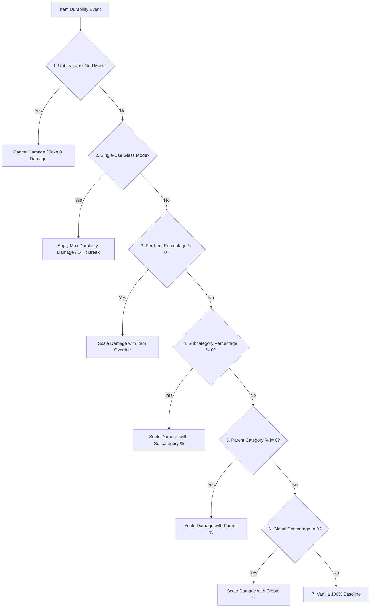

# Classification des objets & Compatibilité des mods (26.2)

| Paramètre système | Valeur |
| :--- | :--- |
| **Méthode de classification** | `DurabilityHelper.classifyItem(ItemStack)` |
| **Moteur de cache** | `ConcurrentHashMap<Item, ItemCategory>` sécurisé pour les threads |
| **Catégories prises en charge** | 22 catégories distinctes et replis |
| **Inspection des composants** | `DataComponents.MAX_DAMAGE`, `EQUIPPABLE`, `TOOL`, `GLIDER` |
| **Inspection des tags** | `#minecraft:*` et `#c:*` (Tags conventionnels / Fabric) |
| **Filtre de durabilité** | `DataComponents.MAX_DAMAGE > 0` (Blocs & meubles strictement filtrés) |

---

## 🔍 Filtrage strict de la durabilité (`MAX_DAMAGE > 0`)

Pour éviter d'encombrer le registre et l'espace de noms des GameRules, Durability Multiplier impose un prérequis strict :

```java
public static boolean isItemDamageable(Item item) {
    if (item == null) return false;
    try {
        Identifier id = BuiltInRegistries.ITEM.getKey(item);
        if (id != null && (FORCED_ITEMS.contains(id) || DurabilityConfig.get().isForced(id.toString()))) {
            return true;
        }
        Integer maxDamage = item.components().get(DataComponents.MAX_DAMAGE);
        return maxDamage != null && maxDamage > 0;
    } catch (Throwable t) {
        return false;
    }
}
```

### Pourquoi les objets de mods non endommageables sont exclus
* **Mods de meubles** (ex. armoires, chaises, tables de Macaw's Furniture) : Ces objets n'ont pas `DataComponents.MAX_DAMAGE` car ce sont des blocs posables.
* **Blocs de construction et matériaux** : La pierre, les lingots, les gemmes, le bois et les objets décoratifs sont totalement ignorés.
* **Nourriture et consommables** : Les consommables ont des piles $> 1$ et aucune durabilité.
* **Bénéfice de performance** : Le pré-filtrage élimine ~95% des objets en $0.0001\mu\text{s}$ au démarrage, assurant une charge nulle.

---

## 👑 Hiérarchie complète d'évaluation et de priorité

Lorsqu'un objet subit un calcul de durabilité, `DurabilityHelper` exécute la séquence stricte à 7 niveaux suivante :



### Analyse des priorités :
1. **Mode Dieu Incassable (`isInfinite`)** :
   * Per-Item Override (`ig:infinity_<mod>_<item>` / `forcedInfinities`) $\rightarrow$ Subcategory (`ig:dm_infinity_pickaxes`) $\rightarrow$ Parent Category (`ig:dm_infinity_tools`) $\rightarrow$ Global (`ig:dm_infinity_global`).
2. **Mode Verre (Usage unique) (`isSingleUse`)** :
   * `-1` Sentinel in percentage rule $\rightarrow$ Per-Item (`ig:single_use_<mod>_<item>`) $\rightarrow$ Subcategory $\rightarrow$ Parent Category $\rightarrow$ Global.
3. **Remplacement de pourcentage par objet** :
   * `ig:percent_<mod>_<item>` or `forcedPercentages` (if $\neq 0$).
4. **Pourcentage de sous-catégorie spécifique** :
   * `ig:dm_percent_swords`, `ig:dm_percent_pickaxes`, `ig:dm_percent_helmets`, etc. (if $\neq 0$).
5. **Pourcentage de catégorie parente** :
   * Tools parent (`ig:dm_percent_tools`), Weapons parent (`ig:dm_percent_weapons`), Armor parent (`ig:dm_percent_armor`) (if $\neq 0$).
6. **Pourcentage global** :
   * `ig:dm_percent_global` (if $\neq 0$).
7. **Base de référence Vanilla** :
   * Default $100\%$ ($1\times$ vanilla durability).

---

## 📦 Critères de correspondance de catégorie et objets pris en charge

### 1. Armes
* **Épées (`ItemCategory.SWORD`)** : `#minecraft:swords`, `#c:swords`, `#c:melee_weapons`, `SwordItem`.
* **Lances (`ItemCategory.SPEAR`)** : `#minecraft:spears`, `#c:spears`.
* **Tridents (`ItemCategory.TRIDENT`)** : `Items.TRIDENT`, `#c:tridents`, `TridentItem`.
* **Masses (`ItemCategory.MACE`)** : `Items.MACE`, `#c:maces`, `MaceItem`.
* **Arcs (`ItemCategory.BOW`)** : `Items.BOW`, `#c:bows`, `BowItem`.
* **Arbalètes (`ItemCategory.CROSSBOW`)** : `Items.CROSSBOW`, `#c:crossbows`, `CrossbowItem`.
* **Boucliers (`ItemCategory.SHIELD`)** : `Items.SHIELD`, `#c:shields`, `ShieldItem`.

### 2. Outils & Utilitaires
* **Pioches (`ItemCategory.PICKAXE`)** : `#minecraft:pickaxes`, `#c:pickaxes`, `PickaxeItem`.
* **Haches (`ItemCategory.AXE`)** : `#minecraft:axes`, `#c:axes`, `AxeItem`.
* **Pelles (`ItemCategory.SHOVEL`)** : `#minecraft:shovels`, `#c:shovels`, `ShovelItem`.
* **Houes (`ItemCategory.HOE`)** : `#minecraft:hoes`, `#c:hoes`, `HoeItem`.
* **Cisailles (`ItemCategory.SHEARS`)** : `Items.SHEARS`, `#c:shears`, `ShearsItem`.
* **Cannes à pêche (`ItemCategory.FISHING_ROD`)** : `Items.FISHING_ROD`, `FishingRodItem`.
* **Pinceaux (`ItemCategory.BRUSH`)** : `Items.BRUSH`, `BrushItem`.
* **Briquets (`ItemCategory.FLINT_AND_STEEL`)** : `Items.FLINT_AND_STEEL`, `FlintAndSteelItem`.
* **Outils globaux (`ItemCategory.TOOL_GLOBAL`)** : Tout objet restant ayant `DataComponents.TOOL` ou `#c:tools`.

### 3. Armures & Équipements
* **Casques (`ItemCategory.HELMET`)** : `#minecraft:head_armor`, `#c:helmets`, `Equippable` (TÊTE).
* **Plastrons (`ItemCategory.CHESTPLATE`)** : `#minecraft:chest_armor`, `#c:chestplates`, `Equippable` (TORSE).
* **Jambières (`ItemCategory.LEGGINGS`)** : `#minecraft:leg_armor`, `#c:leggings`, `Equippable` (JAMBES).
* **Bottes (`ItemCategory.BOOTS`)** : `#minecraft:foot_armor`, `#c:boots`, `Equippable` (PIEDS).
* **Élytres (`ItemCategory.ELYTRA`)** : `Items.ELYTRA`, `DataComponents.GLIDER`.

### 4. Autres / Objets de mods (`ItemCategory.OTHER`)
* Tout objet avec durabilité sans tags standard est classé dans `OTHER` et géré dynamiquement par le [[Scanner dynamique|fr_fr-26.2-Dynamic-Modded-Item-Registration]].

