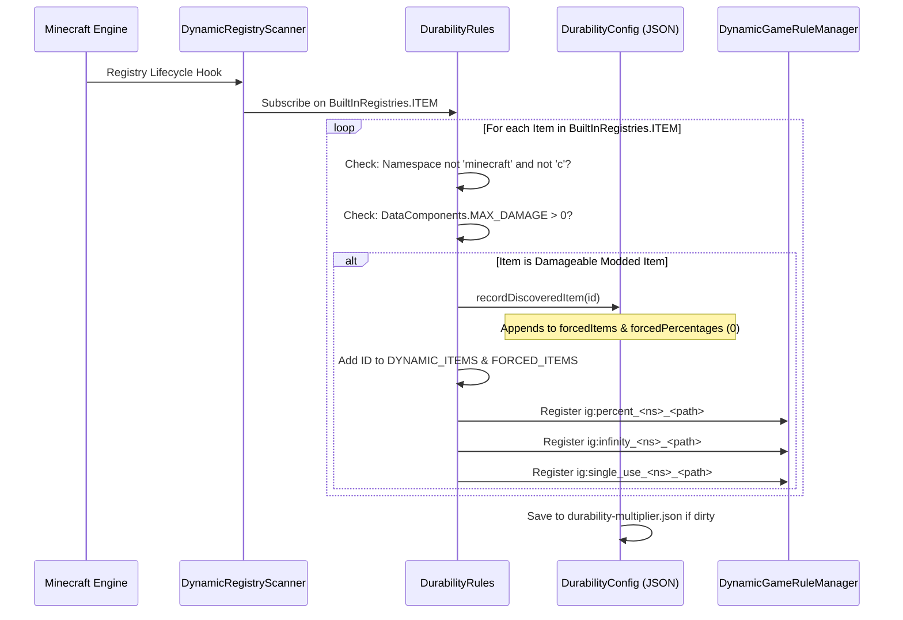

# Pendaftaran Item Mod Dinamis (26.1.2)

| Parameter Sistem | Nilai |
| :--- | :--- |
| **Engine Pemindai** | `DynamicRegistryScanner.subscribe(BuiltInRegistries.ITEM, ...)` |
| **Syarat Ketahanan** | `DataComponents.MAX_DAMAGE > 0` atau terdaftar di `forcedItems` |
| **Namespace yang Diabaikan** | `minecraft`, `c` (ditangani lewat kategori standar vanilla & konvensi) |
| **Daftar Registri Dinamis** | `DurabilityRules.DYNAMIC_ITEMS` & `DurabilityRules.FORCED_ITEMS` |
| **Kunci Persentase yang Dihasilkan** | `ig:percent_<namespace>_<path>` (Min `-1`, Default `0`) |
| **Kunci Tak Terbatas yang Dihasilkan** | `ig:infinity_<namespace>_<path>` (Default `false`) |
| **Kunci Sekali Pakai yang Dihasilkan** | `ig:single_use_<namespace>_<path>` (Default `false`) |
| **Target Pengisian Otomatis** | Daftar `forcedItems` & pemetaan `forcedPercentages` di `config/durability-multiplier.json` |

---

## ⚡ Ringkasan & Tujuan

Banyak mod Minecraft menambahkan senjata kustom, tongkat sihir, atau perkakas energi yang **tidak** memperluas kelas item vanilla standar (`SwordItem`, `PickaxeItem`) atau tag item vanilla (`#minecraft:swords`).

Durability Multiplier mengatasi hal ini melalui **Engine Registrasi Item Dinamis & Pengisian Otomatis** otonom. Setiap item berkurangnya ketahanan dari mod luar akan otomatis terdeteksi, didaftarkan ke GameRule dalam game lengkap dengan saran Tab, dan diisi langsung ke `config/durability-multiplier.json` saat booting.

---

## 🔧 Pemindai Penemuan Universal 3 Tingkat

Mod ini menerapkan siklus hidup pemindaian 3 tingkat untuk memastikan 100% item terdeteksi kapan pun mod lain mendaftarkan itemnya:



### 1. Tingkat 1: Pemindaian Awal (Startup Sweep)
Segera setelah mod diinisialisasi (`DurabilityRules.register()`), engine memindai semua item yang dideklarasikan secara eksplisit dari `config/durability-multiplier.json` dan mendaftarkan GameRule dinamisnya.

### 2. Tingkat 2: Berlangganan Entri Langsung
Mod berlangganan ke `BuiltInRegistries.ITEM` melalui `DynamicRegistryScanner`. Setiap kali mod luar mendaftarkan item baru, callback akan memeriksa item tersebut:
* Jika namespace bukan `minecraft`/`c` dan memiliki `DataComponents.MAX_DAMAGE > 0`, item ditandai ditemukan.
* Item dicatat ke dalam `forcedItems` dan `forcedPercentages` (default `0`).
* GameRule dinamis langsung dibuat saat itu juga.

### 3. Tingkat 3: Pemindaian Keamanan Awal Server
Saat dunia dimuat atau server mulai, pemeriksaan keamanan akhir memastikan item yang terlambat didaftarkan oleh datapack atau mod lain tetap tersinkronisasi.

---

## 📖 Panduan Langkah demi Langkah

### Petunjuk 1: Mengonfigurasi Item Mod di Dalam Game melalui Perintah `/gamerule`

Setiap item mod yang ditemukan mendapatkan tiga GameRule khusus:
1. `ig:percent_<namespace>_<path>`: Menyetel persentase ketahanan (`100` = 1x vanilla, `200` = 2x, `50` = 0.5x, `0` = mewarisi, `-1` = sekali pakai).
2. `ig:infinity_<namespace>_<path>`: Beralih Mode Kebal tak bisa hancur (`true` / `false`).
3. `ig:single_use_<namespace>_<path>`: Beralih Mode Kaca 1-pukulan hancur (`true` / `false`).

#### Contoh Perintah:
```mcfunction
# 1. Query the current percentage for a custom plasma cutter
/gamerule ig:percent_techmod_plasma_cutter

# 2. Give the plasma cutter 500% (5x) durability in the active world
/gamerule ig:percent_techmod_plasma_cutter 500

# 3. Make a magic wand completely unbreakable (God Mode)
/gamerule ig:infinity_magicmod_staff_of_fire true

# 4. Make an obsidian dagger break after a single use (Glass Mode)
/gamerule ig:single_use_customweapons_obsidian_dagger true

# 5. Reset the plasma cutter to inherit global/category settings
/gamerule ig:percent_techmod_plasma_cutter 0
```

> 💡 **Saran Tab Otomatis Seketika**: Ketik `/gamerule ig:percent_` atau `/gamerule ig:infinity_` lalu tekan `Tab` untuk melihat seluruh item mod yang ditemukan langsung terlengkapi!

---

### Petunjuk 2: Mengonfigurasi Awal Item Mod di `durability-multiplier.json`

Bagi pembuat modpack atau pemilik server yang ingin menyetel nilai default untuk dunia masa depan:

1. Jalankan game sekali dengan mod terpasang agar pemindai memeriksa semua item.
2. Buka `config/durability-multiplier.json` di editor teks apa pun.
3. Cari bagian `forcedPercentages`, `forcedInfinities`, atau `forcedSingleUses`.
4. Masukkan nilai yang Anda inginkan:

```json
{
  "configVersion": 2,
  "percentGlobal": 200,
  
  "forcedItems": [
    "techmod:plasma_cutter",
    "magicmod:staff_of_fire",
    "survivalmod:flint_knife"
  ],
  
  "forcedPercentages": {
    "techmod:plasma_cutter": 400,
    "survivalmod:flint_knife": 50
  },
  
  "forcedInfinities": {
    "magicmod:staff_of_fire": true
  },
  
  "forcedSingleUses": {}
}
```

5. Simpan berkas. Dunia baru atau server baru akan menggunakan nilai-nilai ini.

---

### Petunjuk 3: Menggunakan Nilai Sentinel `-1` Mode Kaca Pengguna Mahir

Alih-alih mengaktifkan aturan boolean `ig:single_use_<mod>_<item>`, Anda bisa langsung menyetel `-1` pada aturan persentase apa pun:

```mcfunction
# Set the plasma cutter to 1-hit break mode using the percentage rule
/gamerule ig:percent_techmod_plasma_cutter -1
```

* **Alasan keberhasilan**: Engine evaluasi memeriksa `getEffectivePercent(...) <= -1`. Jika benar, `isSingleUse(...)` langsung mengembalikan `true`.
* **Keuntungan**: Memungkinkan pengaturan mekanisme sekali pakai langsung dari input angka dan penggeser antarmuka.

