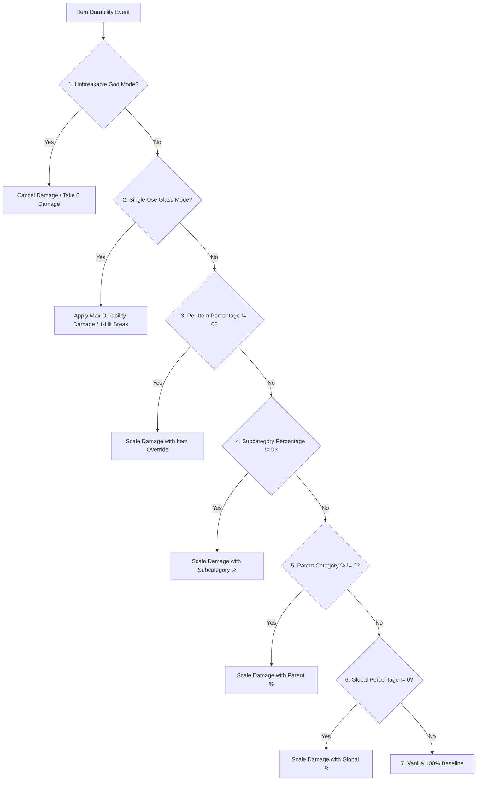

# Klasifikasi Item & Kompatibilitas Mod (26.1.2)

| Parameter Sistem | Nilai |
| :--- | :--- |
| **Metode Klasifikasi** | `DurabilityHelper.classifyItem(ItemStack)` |
| **Engine Cache** | `ConcurrentHashMap<Item, ItemCategory>` yang aman untuk thread |
| **Kategori yang Didukung** | 22 Kategori Khusus & Cadangan |
| **Inspeksi Komponen** | `DataComponents.MAX_DAMAGE`, `EQUIPPABLE`, `TOOL`, `GLIDER` |
| **Inspeksi Tag** | `#minecraft:*` dan `#c:*` (Tag Konvensional / Fabric) |
| **Gerbang Ketahanan** | `DataComponents.MAX_DAMAGE > 0` (Blok & Mebel disaring ketat) |

---

## 🔍 Penyaringan Ketat Daya Tahan (`MAX_DAMAGE > 0`)

Untuk mencegah penumpukan registri dan polusi namespace GameRules, Durability Multiplier memberlakukan prasyarat ketat:

```java
public static boolean isItemDamageable(Item item) {
    if (item == null) return false;
    try {
        Identifier id = BuiltInRegistries.ITEM.getKey(item);
        if (id != null && (FORCED_ITEMS.contains(id) || DurabilityConfig.get().isForced(id.toString()))) {
            return true;
        }
        Integer maxDamage = item.components().get(DataComponents.MAX_DAMAGE);
        return maxDamage != null && maxDamage > 0;
    } catch (Throwable t) {
        return false;
    }
}
```

### Mengapa Item Mod yang Tidak Dapat Rusak Dikecualikan
* **Mod Furnitur** (misal lemari, kursi, meja dari Macaw's Furniture): Item-item ini tidak memiliki `DataComponents.MAX_DAMAGE` karena merupakan blok yang dapat diletakkan, bukan perkakas yang aus.
* **Blok Bangunan & Material**: Batu, batangan, permata, kayu, dan item dekorasi sepenuhnya diabaikan oleh pemindai.
* **Makanan & Barang Habis Pakai**: Memiliki ukuran tumpukan $> 1$ dan nol ketahanan.
* **Keuntungan Performa**: Pra-penyaringan menyingkirkan ~95% item game dalam $0.0001\mu\text{s}$, memastikan tanpa beban performa dan saran perintah tetap bersih.

---

## 👑 Hierarki Evaluasi & Prioritas Lengkap

Saat item menjalani perhitungan ketahanan, `DurabilityHelper` menjalankan urutan evaluasi 7 tingkat yang ketat berikut:



### Rincian Prioritas:
1. **Pemeriksaan Mode Kebal Tak Bisa Hancur (`isInfinite`)**:
   * Per-Item Override (`ig:infinity_<mod>_<item>` / `forcedInfinities`) $\rightarrow$ Subcategory (`ig:dm_infinity_pickaxes`) $\rightarrow$ Parent Category (`ig:dm_infinity_tools`) $\rightarrow$ Global (`ig:dm_infinity_global`).
2. **Pemeriksaan Mode Kaca Sekali Pakai (`isSingleUse`)**:
   * `-1` Sentinel in percentage rule $\rightarrow$ Per-Item (`ig:single_use_<mod>_<item>`) $\rightarrow$ Subcategory $\rightarrow$ Parent Category $\rightarrow$ Global.
3. **Penimpaan Persentase per Item**:
   * `ig:percent_<mod>_<item>` or `forcedPercentages` (if $\neq 0$).
4. **Persentase Subkategori Khusus**:
   * `ig:dm_percent_swords`, `ig:dm_percent_pickaxes`, `ig:dm_percent_helmets`, etc. (if $\neq 0$).
5. **Persentase Kategori Induk**:
   * Tools parent (`ig:dm_percent_tools`), Weapons parent (`ig:dm_percent_weapons`), Armor parent (`ig:dm_percent_armor`) (if $\neq 0$).
6. **Persentase Global Dasar**:
   * `ig:dm_percent_global` (if $\neq 0$).
7. **Garis Dasar Vanilla**:
   * Default $100\%$ ($1\times$ vanilla durability).

---

## 📦 Kriteria Kecocokan Kategori & Item yang Didukung

### 1. Senjata
* **Pedang (`ItemCategory.SWORD`)**: `#minecraft:swords`, `#c:swords`, `#c:melee_weapons`, `SwordItem`.
* **Tombak (`ItemCategory.SPEAR`)**: `#minecraft:spears`, `#c:spears`.
* **Trisula (`ItemCategory.TRIDENT`)**: `Items.TRIDENT`, `#c:tridents`, `TridentItem`.
* **Gada (`ItemCategory.MACE`)**: `Items.MACE`, `#c:maces`, `MaceItem`.
* **Busur (`ItemCategory.BOW`)**: `Items.BOW`, `#c:bows`, `BowItem`.
* **Busur Silang (`ItemCategory.CROSSBOW`)**: `Items.CROSSBOW`, `#c:crossbows`, `CrossbowItem`.
* **Perisai (`ItemCategory.SHIELD`)**: `Items.SHIELD`, `#c:shields`, `ShieldItem`.

### 2. Alat & Kegunaan
* **Beliung (`ItemCategory.PICKAXE`)**: `#minecraft:pickaxes`, `#c:pickaxes`, `PickaxeItem`.
* **Kapak (`ItemCategory.AXE`)**: `#minecraft:axes`, `#c:axes`, `AxeItem`.
* **Sekop (`ItemCategory.SHOVEL`)**: `#minecraft:shovels`, `#c:shovels`, `ShovelItem`.
* **Cangkul (`ItemCategory.HOE`)**: `#minecraft:hoes`, `#c:hoes`, `HoeItem`.
* **Gunting (`ItemCategory.SHEARS`)**: `Items.SHEARS`, `#c:shears`, `ShearsItem`.
* **Alat Pancing (`ItemCategory.FISHING_ROD`)**: `Items.FISHING_ROD`, `FishingRodItem`.
* **Kuas (`ItemCategory.BRUSH`)**: `Items.BRUSH`, `BrushItem`.
* **Pemantik Api (`ItemCategory.FLINT_AND_STEEL`)**: `Items.FLINT_AND_STEEL`, `FlintAndSteelItem`.
* **Perkakas Global (`ItemCategory.TOOL_GLOBAL`)**: Semua item tersisa yang memiliki `DataComponents.TOOL` atau `#c:tools`.

### 3. Armor & Perlengkapan yang Dapat Dipakai
* **Helm (`ItemCategory.HELMET`)**: `#minecraft:head_armor`, `#c:helmets`, `Equippable` (KEPALA).
* **Baju Zirah (`ItemCategory.CHESTPLATE`)**: `#minecraft:chest_armor`, `#c:chestplates`, `Equippable` (DADA).
* **Celana Zirah (`ItemCategory.LEGGINGS`)**: `#minecraft:leg_armor`, `#c:leggings`, `Equippable` (KAKI).
* **Sepatu Zirah (`ItemCategory.BOOTS`)**: `#minecraft:foot_armor`, `#c:boots`, `Equippable` (TELAPAK KAKI).
* **Elitra (`ItemCategory.ELYTRA`)**: `Items.ELYTRA`, `DataComponents.GLIDER`.

### 4. Item Lainnya / Mod (`ItemCategory.OTHER`)
* Semua item yang tidak cocok dengan tag atau komponen standar ditetapkan ke `OTHER` dan dikelola secara dinamis melalui [[Pemindai Dinamis|id_id-26.1.2-Dynamic-Modded-Item-Registration]].

