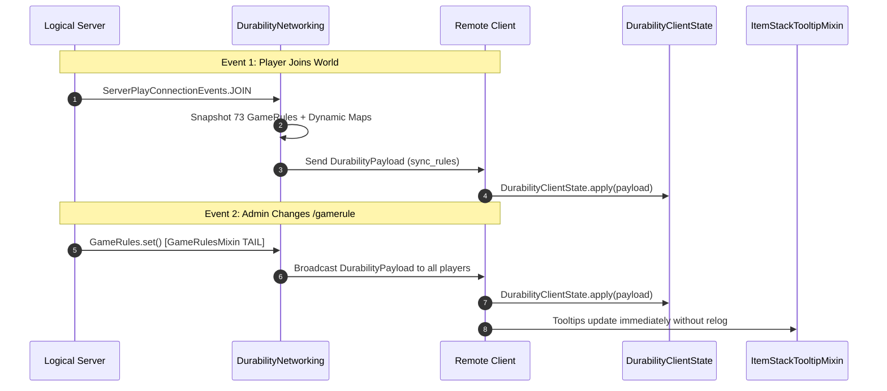

# Protokol Sinkronisasi Jaringan & Muatan (26.1.2)

| Parameter Protokol | Nilai |
| :--- | :--- |
| **Pengenal Saluran** | `durability-multiplier:sync_rules` |
| **Kelas Payload** | `net.instantgratification.durabilitymultiplier.network.DurabilityPayload` |
| **Manajer Jaringan** | `net.instantgratification.durabilitymultiplier.network.DurabilityNetworking` |
| **Cache Status Klien** | `net.instantgratification.durabilitymultiplier.network.DurabilityClientState` |
| **Tipe Codec** | `StreamCodec<FriendlyByteBuf, DurabilityPayload>` |
| **Pemicu Sinkronisasi** | Pemain Masuk (`ServerPlayConnectionEvents.JOIN`) & Perubahan Aturan (`GameRulesMixin`) |

---

## ⚡ Arsitektur Protokol

Karena tooltip dirender pada klien fisik sementara GameRules berada di server logis, Durability Multiplier menggunakan Fabric Networking API untuk mengirim snapshot langsung dari seluruh 73 GameRule statis beserta aturan mod dinamis ke klien.



---

## 📦 Struktur Muatan (76 Bidang & Peta Dinamis)

`DurabilityPayload` menyerialisasi semua GameRules dan pemetaan dinamis secara efisien menggunakan VarInt, Boolean, dan codec Map dari `FriendlyByteBuf`:

```java
public record DurabilityPayload(
    int percentGlobal,
    int percentWeapons,
    int percentSwords,
    int percentSpears,
    int percentTridents,
    int percentMaces,
    int percentBows,
    int percentCrossbows,
    int percentShields,
    int percentTools,
    int percentPickaxes,
    int percentAxes,
    int percentShovels,
    int percentHoes,
    int percentShears,
    int percentFishingRods,
    int percentBrushes,
    int percentFlintAndSteel,
    int percentArmor,
    int percentHelmets,
    int percentChestplates,
    int percentLeggings,
    int percentBoots,
    int percentElytra,
    
    boolean infinityGlobal,
    boolean infinityWeapons,
    boolean infinitySwords,
    boolean infinitySpears,
    boolean infinityTridents,
    boolean infinityMaces,
    boolean infinityBows,
    boolean infinityCrossbows,
    boolean infinityShields,
    boolean infinityTools,
    boolean infinityPickaxes,
    boolean infinityAxes,
    boolean infinityShovels,
    boolean infinityHoes,
    boolean infinityShears,
    boolean infinityFishingRods,
    boolean infinityBrushes,
    boolean infinityFlintAndSteel,
    boolean infinityArmor,
    boolean infinityHelmets,
    boolean infinityChestplates,
    boolean infinityLeggings,
    boolean infinityBoots,
    boolean infinityElytra,
    
    boolean singleUseGlobal,
    boolean singleUseWeapons,
    boolean singleUseSwords,
    boolean singleUseSpears,
    boolean singleUseTridents,
    boolean singleUseMaces,
    boolean singleUseBows,
    boolean singleUseCrossbows,
    boolean singleUseShields,
    boolean singleUseTools,
    boolean singleUsePickaxes,
    boolean singleUseAxes,
    boolean singleUseShovels,
    boolean singleUseHoes,
    boolean singleUseShears,
    boolean singleUseFishingRods,
    boolean singleUseBrushes,
    boolean singleUseFlintAndSteel,
    boolean singleUseArmor,
    boolean singleUseHelmets,
    boolean singleUseChestplates,
    boolean singleUseLeggings,
    boolean singleUseBoots,
    boolean singleUseElytra,

    boolean showTooltip,
    
    java.util.Map<String, Integer> dynamicPercentages,
    java.util.Map<String, Boolean> dynamicInfinities,
    java.util.Map<String, Boolean> dynamicSingleUses
) implements CustomPacketPayload
```
