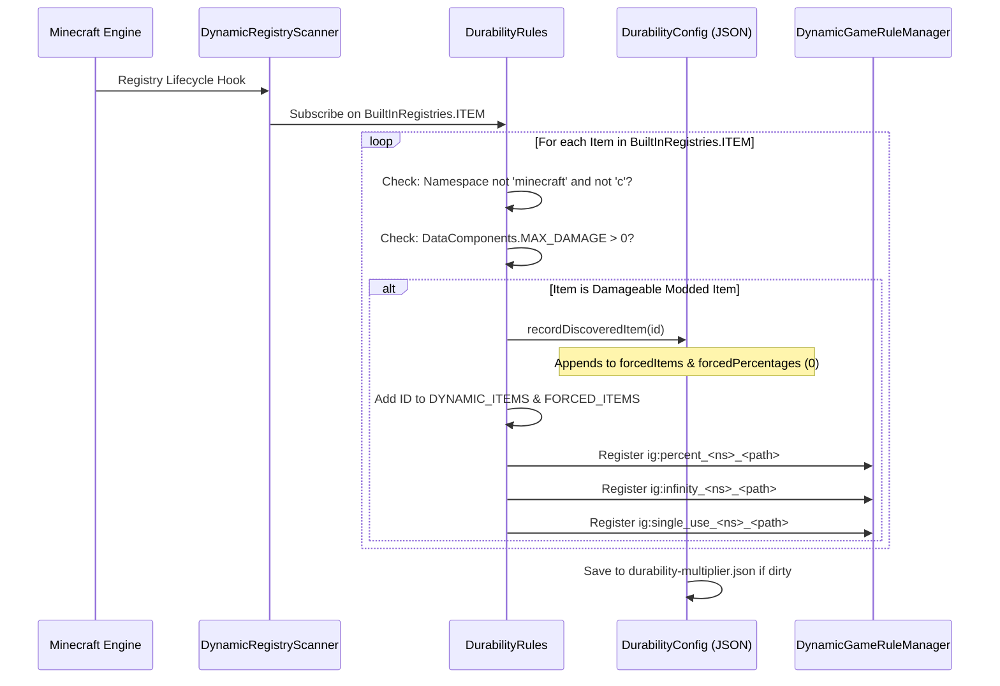

# 動的Modアイテム登録 (26.2)

| システムパラメータ | 設定値 |
| :--- | :--- |
| **スキャナーエンジン** | `DynamicRegistryScanner.subscribe(BuiltInRegistries.ITEM, ...)` |
| **耐久度判定条件** | `DataComponents.MAX_DAMAGE > 0` または `forcedItems`への登録 |
| **除外名前空間** | `minecraft`, `c`（バニラおよび共通カテゴリとして処理） |
| **動的登録リスト** | `DurabilityRules.DYNAMIC_ITEMS` & `DurabilityRules.FORCED_ITEMS` |
| **生成パーセントキー** | `ig:percent_<namespace>_<path>` (最小 `-1`, 初期値 `0`) |
| **生成ゴッドモードキー** | `ig:infinity_<namespace>_<path>` (初期値 `false`) |
| **生成使い捨てキー** | `ig:single_use_<namespace>_<path>` (初期値 `false`) |
| **自動入力対象** | `config/durability-multiplier.json`内の`forcedItems`および`forcedPercentages` |

---

## ⚡ 概要と目的

多くのMinecraft Modは、標準的なバニラアイテムクラス（`SwordItem`, `PickaxeItem`）を継承せず、バニラタグ（`#minecraft:swords`）も持たないカスタム武器や魔法の杖、エネルギー機器を追加します。

Durability Multiplierは、自律的な**動的アイテム登録＆自動入力エンジン**によってこれを解決します。耐久度を持つすべてのModアイテムが自動検知され、Tab補完付きでゲーム内ルールに登録され、起動時に`config/durability-multiplier.json`へ自動反映されます。

---

## 🔧 ユニバーサル3段階検出スキャナー

他Modの登録タイミングに関わらず100%のアイテム検知を保証するため、3段階のスキャンライフサイクルを実装しています：



### 1. 第1層：起動時スキャン
Modの初期化時（`DurabilityRules.register()`）に、設定ファイル（`forcedItems`, `forcedPercentages`等）に明示されたアイテムを即座にスキャンし動的ゲームルールを登録します。

### 2. 第2層：動的登録の購読
`DynamicRegistryScanner`を介して`BuiltInRegistries.ITEM`を監視します。外部Modが新しいアイテムを登録するたびにコールバックが検査を実行します：
* 名前空間が対象外で耐久度を持つ場合、検知済みとしてマークされます。
* アイテムが`forcedItems`と`forcedPercentages`（初期値0）に記録されます。
* 動的ゲームルールがその場で即時生成されます。

### 3. 第3層：サーバー起動時セーフティスキャン
ワールド読み込みまたはサーバー起動時に最終セーフティパスを実行し、データパックや遅延ロードModのアイテムを確実に捕捉・同期します。

---

## 📖 ステップバイステップ導入ガイド

### 手順1: `/gamerule` コマンドでゲーム内のModアイテムを設定する

発見されたすべてのModアイテムは、3つの専用ゲームルールを受け取ります：
1. `ig:percent_<namespace>_<path>`: 耐久度パーセントを設定（`100` = 1倍、`200` = 2倍、`50` = 0.5倍、`0` = 継承、`-1` = 使い捨て）。
2. `ig:infinity_<namespace>_<path>`: 壊れないゴッドモードの切り替え（`true` / `false`）。
3. `ig:single_use_<namespace>_<path>`: 初撃破損ガラスモードの切り替え（`true` / `false`）。

#### 実行例コマンド：
```mcfunction
# 1. Query the current percentage for a custom plasma cutter
/gamerule ig:percent_techmod_plasma_cutter

# 2. Give the plasma cutter 500% (5x) durability in the active world
/gamerule ig:percent_techmod_plasma_cutter 500

# 3. Make a magic wand completely unbreakable (God Mode)
/gamerule ig:infinity_magicmod_staff_of_fire true

# 4. Make an obsidian dagger break after a single use (Glass Mode)
/gamerule ig:single_use_customweapons_obsidian_dagger true

# 5. Reset the plasma cutter to inherit global/category settings
/gamerule ig:percent_techmod_plasma_cutter 0
```

> 💡 **瞬時のTab補完**: `/gamerule ig:percent_`や`/gamerule ig:infinity_`と入力して`Tab`キーを押すと、検知されたModアイテムが即座に補完候補に現れます！

---

### 手順2: `durability-multiplier.json` でModアイテムを事前設定する

Modパック制作者や、新規ワールドの初期値を統一したいサーバー管理者の場合：

1. Modを導入した状態でゲームを一度起動し、スキャナーにアイテムを走査させます。
2. テキストエディタで`config/durability-multiplier.json`を開きます。
3. `forcedPercentages`, `forcedInfinities`, `forcedSingleUses`のセクションを探します。
4. 任意の設定値を記入します：

```json
{
  "configVersion": 2,
  "percentGlobal": 200,
  
  "forcedItems": [
    "techmod:plasma_cutter",
    "magicmod:staff_of_fire",
    "survivalmod:flint_knife"
  ],
  
  "forcedPercentages": {
    "techmod:plasma_cutter": 400,
    "survivalmod:flint_knife": 50
  },
  
  "forcedInfinities": {
    "magicmod:staff_of_fire": true
  },
  
  "forcedSingleUses": {}
}
```

5. ファイルを保存します。以降作成される新規ワールドやサーバーはこれらの初期値を採用します。

---

### 手順3: 上級者向け `-1` グラスモード番兵値を使用する

ブール型の`ig:single_use_<mod>_<item>`を切り替える代わりに、パーセントルールに直接`-1`を設定することも可能です：

```mcfunction
# Set the plasma cutter to 1-hit break mode using the percentage rule
/gamerule ig:percent_techmod_plasma_cutter -1
```

* **動作の仕組み**: 評価エンジンが`getEffectivePercent(...) <= -1`を検証し、真であれば`isSingleUse(...)`が直ちに`true`を返します。
* **利点**: 数値入力欄やスライダーUIから直接、使い捨てメカニクスを適用できます。

