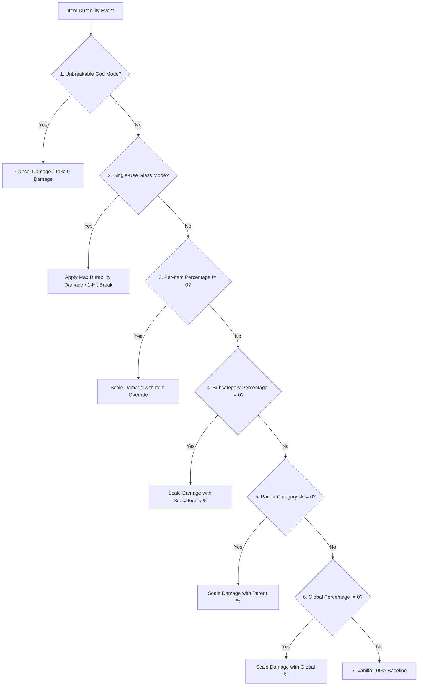

# アイテム分類とMod互換性 (26.2)

| システムパラメータ | 設定値 |
| :--- | :--- |
| **分類判定メソッド** | `DurabilityHelper.classifyItem(ItemStack)` |
| **キャッシュ機構** | スレッドセーフな`ConcurrentHashMap<Item, ItemCategory>` |
| **対応カテゴリ** | 22種類の個別カテゴリおよびフォールバック |
| **コンポーネント検査** | `DataComponents.MAX_DAMAGE`, `EQUIPPABLE`, `TOOL`, `GLIDER` |
| **タグ検査** | `#minecraft:*` および `#c:*`（慣例 / Fabricタグ） |
| **耐久度ゲート** | `DataComponents.MAX_DAMAGE > 0`（ブロック・家具等は厳格に除外） |

---

## 🔍 厳格な耐久値フィルタリング (`MAX_DAMAGE > 0`)

レジストリの肥大化やゲームルール名前空間の汚染を防ぐため、厳格な前提条件を適用しています：

```java
public static boolean isItemDamageable(Item item) {
    if (item == null) return false;
    try {
        Identifier id = BuiltInRegistries.ITEM.getKey(item);
        if (id != null && (FORCED_ITEMS.contains(id) || DurabilityConfig.get().isForced(id.toString()))) {
            return true;
        }
        Integer maxDamage = item.components().get(DataComponents.MAX_DAMAGE);
        return maxDamage != null && maxDamage > 0;
    } catch (Throwable t) {
        return false;
    }
}
```

### 耐久値のないModアイテムが除外される理由
* **家具Mod**（Macaw's Furnitureなど）: 設置可能なブロックであり消耗品ではないため、`DataComponents.MAX_DAMAGE`を持っていません。
* **建築ブロック・素材**: 石、インゴット、宝石、木材、装飾ブロックなどは完全に無視されます。
* **食料・消費アイテム**: スタックサイズが$> 1$で耐久度を持たないため対象外です。
* **性能面での利点**: 事前フィルタリングにより、起動時にアイテムの約95%が瞬時に除外され、オーバーヘッドが一切発生しません。

---

## 👑 完全な評価と優先順位の階層

アイテムの耐久度計算が行われる際、`DurabilityHelper`は以下の厳格な7段階の判定階層を実行します：



### 優先度の詳細：
1. **壊れないゴッドモード判定 (`isInfinite`)**:
   * Per-Item Override (`ig:infinity_<mod>_<item>` / `forcedInfinities`) $\rightarrow$ Subcategory (`ig:dm_infinity_pickaxes`) $\rightarrow$ Parent Category (`ig:dm_infinity_tools`) $\rightarrow$ Global (`ig:dm_infinity_global`).
2. **使い捨てガラスモード判定 (`isSingleUse`)**:
   * `-1` Sentinel in percentage rule $\rightarrow$ Per-Item (`ig:single_use_<mod>_<item>`) $\rightarrow$ Subcategory $\rightarrow$ Parent Category $\rightarrow$ Global.
3. **アイテム個別の倍率上書き**:
   * `ig:percent_<mod>_<item>` or `forcedPercentages` (if $\neq 0$).
4. **個別サブカテゴリの倍率**:
   * `ig:dm_percent_swords`, `ig:dm_percent_pickaxes`, `ig:dm_percent_helmets`, etc. (if $\neq 0$).
5. **親カテゴリの倍率**:
   * Tools parent (`ig:dm_percent_tools`), Weapons parent (`ig:dm_percent_weapons`), Armor parent (`ig:dm_percent_armor`) (if $\neq 0$).
6. **全体の基本倍率**:
   * `ig:dm_percent_global` (if $\neq 0$).
7. **バニラ基準値**:
   * Default $100\%$ ($1\times$ vanilla durability).

---

## 📦 カテゴリ一致基準と対応アイテム

### 1. 武器
* **剣 (`ItemCategory.SWORD`)**: `#minecraft:swords`, `#c:swords`, `#c:melee_weapons`, `SwordItem`。
* **槍 (`ItemCategory.SPEAR`)**: `#minecraft:spears`, `#c:spears`。
* **トライデント (`ItemCategory.TRIDENT`)**: `Items.TRIDENT`, `#c:tridents`, `TridentItem`。
* **メイス (`ItemCategory.MACE`)**: `Items.MACE`, `#c:maces`, `MaceItem`。
* **弓 (`ItemCategory.BOW`)**: `Items.BOW`, `#c:bows`, `BowItem`。
* **クロスボウ (`ItemCategory.CROSSBOW`)**: `Items.CROSSBOW`, `#c:crossbows`, `CrossbowItem`。
* **盾 (`ItemCategory.SHIELD`)**: `Items.SHIELD`, `#c:shields`, `ShieldItem`。

### 2. ツールと実用アイテム
* **ツルハシ (`ItemCategory.PICKAXE`)**: `#minecraft:pickaxes`, `#c:pickaxes`, `PickaxeItem`。
* **斧 (`ItemCategory.AXE`)**: `#minecraft:axes`, `#c:axes`, `AxeItem`。
* **シャベル (`ItemCategory.SHOVEL`)**: `#minecraft:shovels`, `#c:shovels`, `ShovelItem`。
* **クワ (`ItemCategory.HOE`)**: `#minecraft:hoes`, `#c:hoes`, `HoeItem`。
* **ハサミ (`ItemCategory.SHEARS`)**: `Items.SHEARS`, `#c:shears`, `ShearsItem`。
* **釣竿 (`ItemCategory.FISHING_ROD`)**: `Items.FISHING_ROD`, `FishingRodItem`。
* **ブラシ (`ItemCategory.BRUSH`)**: `Items.BRUSH`, `BrushItem`。
* **火打石と打ち金 (`ItemCategory.FLINT_AND_STEEL`)**: `Items.FLINT_AND_STEEL`, `FlintAndSteelItem`。
* **道具全般 (`ItemCategory.TOOL_GLOBAL`)**: `DataComponents.TOOL`または`#c:tools`を持つその他の全アイテム。

### 3. 防具と装備品
* **ヘルメット (`ItemCategory.HELMET`)**: `#minecraft:head_armor`, `#c:helmets`, `Equippable` (頭)。
* **チェストプレート (`ItemCategory.CHESTPLATE`)**: `#minecraft:chest_armor`, `#c:chestplates`, `Equippable` (胸)。
* **レギンス (`ItemCategory.LEGGINGS`)**: `#minecraft:leg_armor`, `#c:leggings`, `Equippable` (脚)。
* **ブーツ (`ItemCategory.BOOTS`)**: `#minecraft:foot_armor`, `#c:boots`, `Equippable` (足)。
* **エリトラ (`ItemCategory.ELYTRA`)**: `Items.ELYTRA`, `DataComponents.GLIDER`。

### 4. その他 / Modアイテム (`ItemCategory.OTHER`)
* 標準タグやコンポーネントを持たない耐久度アイテムは`OTHER`に割り当てられ、[[動的スキャナー|ja_jp-26.2-Dynamic-Modded-Item-Registration]]を通じて管理されます。

