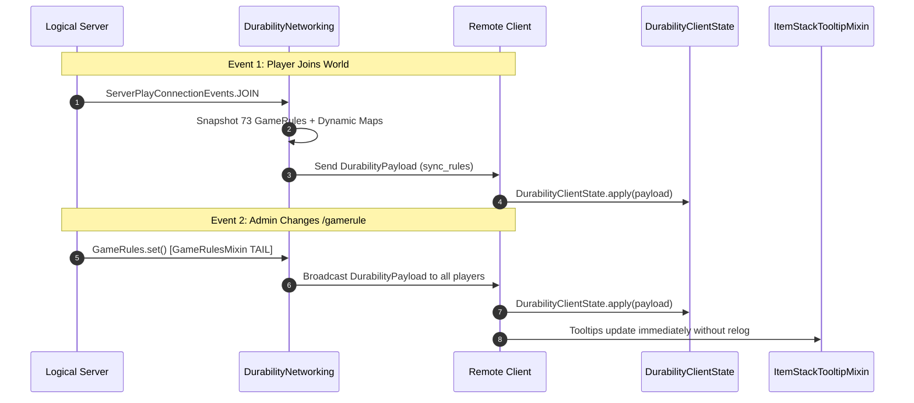

# ネットワーク同期と通信プロトコル (26.2)

| プロトコルパラメータ | 設定値 |
| :--- | :--- |
| **チャンネル識別子** | `durability-multiplier:sync_rules` |
| **ペイロードクラス** | `net.instantgratification.durabilitymultiplier.network.DurabilityPayload` |
| **ネットワークマネージャ** | `net.instantgratification.durabilitymultiplier.network.DurabilityNetworking` |
| **クライアント状態キャッシュ** | `net.instantgratification.durabilitymultiplier.network.DurabilityClientState` |
| **コーデック種別** | `StreamCodec<FriendlyByteBuf, DurabilityPayload>` |
| **同期トリガー** | プレイヤー参加 (`ServerPlayConnectionEvents.JOIN`) および ゲームルール変更 (`GameRulesMixin`) |

---

## ⚡ プロトコルアーキテクチャ

ツールチップはクライアント側で描画されますが、ゲームルールはサーバー上に存在します。Durability MultiplierはFabric Networking APIを使用して、全73個の静的ルールおよび動的ルールのスナップショットをクライアントへ配信します。



---

## 📦 ペイロード構造 (76のフィールドと動的マップ)

`DurabilityPayload`は、VarIntやBoolean、マップコーデックを用いて全ルールと動的マップを効率的にシリアライズします：

```java
public record DurabilityPayload(
    int percentGlobal,
    int percentWeapons,
    int percentSwords,
    int percentSpears,
    int percentTridents,
    int percentMaces,
    int percentBows,
    int percentCrossbows,
    int percentShields,
    int percentTools,
    int percentPickaxes,
    int percentAxes,
    int percentShovels,
    int percentHoes,
    int percentShears,
    int percentFishingRods,
    int percentBrushes,
    int percentFlintAndSteel,
    int percentArmor,
    int percentHelmets,
    int percentChestplates,
    int percentLeggings,
    int percentBoots,
    int percentElytra,
    
    boolean infinityGlobal,
    boolean infinityWeapons,
    boolean infinitySwords,
    boolean infinitySpears,
    boolean infinityTridents,
    boolean infinityMaces,
    boolean infinityBows,
    boolean infinityCrossbows,
    boolean infinityShields,
    boolean infinityTools,
    boolean infinityPickaxes,
    boolean infinityAxes,
    boolean infinityShovels,
    boolean infinityHoes,
    boolean infinityShears,
    boolean infinityFishingRods,
    boolean infinityBrushes,
    boolean infinityFlintAndSteel,
    boolean infinityArmor,
    boolean infinityHelmets,
    boolean infinityChestplates,
    boolean infinityLeggings,
    boolean infinityBoots,
    boolean infinityElytra,
    
    boolean singleUseGlobal,
    boolean singleUseWeapons,
    boolean singleUseSwords,
    boolean singleUseSpears,
    boolean singleUseTridents,
    boolean singleUseMaces,
    boolean singleUseBows,
    boolean singleUseCrossbows,
    boolean singleUseShields,
    boolean singleUseTools,
    boolean singleUsePickaxes,
    boolean singleUseAxes,
    boolean singleUseShovels,
    boolean singleUseHoes,
    boolean singleUseShears,
    boolean singleUseFishingRods,
    boolean singleUseBrushes,
    boolean singleUseFlintAndSteel,
    boolean singleUseArmor,
    boolean singleUseHelmets,
    boolean singleUseChestplates,
    boolean singleUseLeggings,
    boolean singleUseBoots,
    boolean singleUseElytra,

    boolean showTooltip,
    
    java.util.Map<String, Integer> dynamicPercentages,
    java.util.Map<String, Boolean> dynamicInfinities,
    java.util.Map<String, Boolean> dynamicSingleUses
) implements CustomPacketPayload
```
