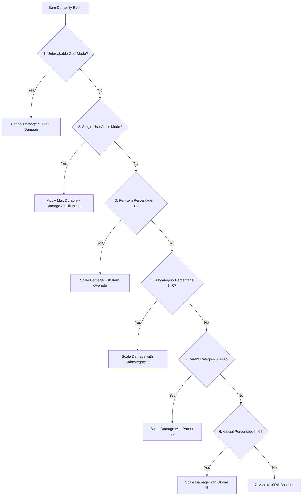

# 아이템 분류 및 모드 호환성 (26.1.2)

| 시스템 매개변수 | 설정값 |
| :--- | :--- |
| **분류 판정 메서드** | `DurabilityHelper.classifyItem(ItemStack)` |
| **캐싱 엔진** | 스레드 안전한 `ConcurrentHashMap<Item, ItemCategory>` |
| **지원 범주** | 22개 개별 범주 및 폴백 |
| **컴포넌트 검사** | `DataComponents.MAX_DAMAGE`, `EQUIPPABLE`, `TOOL`, `GLIDER` |
| **태그 검사** | `#minecraft:*` 및 `#c:*` (관례 / Fabric 태그) |
| **내구도 게이트** | `DataComponents.MAX_DAMAGE > 0` (블록 및 가구 엄격 필터링) |

---

## 🔍 엄격한 내구도 필터링 (`MAX_DAMAGE > 0`)

레지스트리 혼잡과 게임 규칙 네임스페이스 오염을 방지하기 위해 엄격한 사전 조건을 적용합니다:

```java
public static boolean isItemDamageable(Item item) {
    if (item == null) return false;
    try {
        Identifier id = BuiltInRegistries.ITEM.getKey(item);
        if (id != null && (FORCED_ITEMS.contains(id) || DurabilityConfig.get().isForced(id.toString()))) {
            return true;
        }
        Integer maxDamage = item.components().get(DataComponents.MAX_DAMAGE);
        return maxDamage != null && maxDamage > 0;
    } catch (Throwable t) {
        return false;
    }
}
```

### 내구도가 없는 모드 아이템이 제외되는 이유
* **가구 모드** (Macaw's Furniture 등): 설치형 블록이며 소모성 도구가 아니므로 `DataComponents.MAX_DAMAGE` 컴포넌트를 갖지 않습니다.
* **건축 블록 및 재료**: 돌, 주괴, 보석, 목재, 장식 아이템은 스캐너에 의해 완전히 무시됩니다.
* **음식 및 소모품**: 스택 크기가 $> 1$이며 내구도가 없습니다.
* **성능상 이점**: 사전 필터링을 통해 시작 시 약 95%의 아이템을 $0.0001\mu\text{s}$ 만에 걸러내어 부하가 전혀 없습니다.

---

## 👑 완전한 평가 및 우선순위 계층

아이템의 내구도 계산이 진행될 때, `DurabilityHelper`는 다음의 엄격한 7단계 평가 계층을 실행합니다:



### 우선순위 분석:
1. **파괴 불가 신 모드 확인 (`isInfinite`)**:
   * Per-Item Override (`ig:infinity_<mod>_<item>` / `forcedInfinities`) $\rightarrow$ Subcategory (`ig:dm_infinity_pickaxes`) $\rightarrow$ Parent Category (`ig:dm_infinity_tools`) $\rightarrow$ Global (`ig:dm_infinity_global`).
2. **1회용 유리 모드 확인 (`isSingleUse`)**:
   * `-1` Sentinel in percentage rule $\rightarrow$ Per-Item (`ig:single_use_<mod>_<item>`) $\rightarrow$ Subcategory $\rightarrow$ Parent Category $\rightarrow$ Global.
3. **아이템별 퍼센트 재정의**:
   * `ig:percent_<mod>_<item>` or `forcedPercentages` (if $\neq 0$).
4. **세부 범주별 퍼센트**:
   * `ig:dm_percent_swords`, `ig:dm_percent_pickaxes`, `ig:dm_percent_helmets`, etc. (if $\neq 0$).
5. **상위 범주별 퍼센트**:
   * Tools parent (`ig:dm_percent_tools`), Weapons parent (`ig:dm_percent_weapons`), Armor parent (`ig:dm_percent_armor`) (if $\neq 0$).
6. **전체 기본 퍼센트**:
   * `ig:dm_percent_global` (if $\neq 0$).
7. **바닐라 기준값**:
   * Default $100\%$ ($1\times$ vanilla durability).

---

## 📦 카테고리 일치 기준 및 지원되는 아이템

### 1. 무기
* **검 (`ItemCategory.SWORD`)**: `#minecraft:swords`, `#c:swords`, `#c:melee_weapons`, `SwordItem`.
* **창 (`ItemCategory.SPEAR`)**: `#minecraft:spears`, `#c:spears`.
* **삼지창 (`ItemCategory.TRIDENT`)**: `Items.TRIDENT`, `#c:tridents`, `TridentItem`.
* **메이스 (`ItemCategory.MACE`)**: `Items.MACE`, `#c:maces`, `MaceItem`.
* **활 (`ItemCategory.BOW`)**: `Items.BOW`, `#c:bows`, `BowItem`.
* **쇠뇌 (`ItemCategory.CROSSBOW`)**: `Items.CROSSBOW`, `#c:crossbows`, `CrossbowItem`.
* **방패 (`ItemCategory.SHIELD`)**: `Items.SHIELD`, `#c:shields`, `ShieldItem`.

### 2. 도구 및 유틸리티
* **곡괭이 (`ItemCategory.PICKAXE`)**: `#minecraft:pickaxes`, `#c:pickaxes`, `PickaxeItem`.
* **도끼 (`ItemCategory.AXE`)**: `#minecraft:axes`, `#c:axes`, `AxeItem`.
* **삽 (`ItemCategory.SHOVEL`)**: `#minecraft:shovels`, `#c:shovels`, `ShovelItem`.
* **괭이 (`ItemCategory.HOE`)**: `#minecraft:hoes`, `#c:hoes`, `HoeItem`.
* **가위 (`ItemCategory.SHEARS`)**: `Items.SHEARS`, `#c:shears`, `ShearsItem`.
* **낚싯대 (`ItemCategory.FISHING_ROD`)**: `Items.FISHING_ROD`, `FishingRodItem`.
* **솔 (`ItemCategory.BRUSH`)**: `Items.BRUSH`, `BrushItem`.
* **라이터 (`ItemCategory.FLINT_AND_STEEL`)**: `Items.FLINT_AND_STEEL`, `FlintAndSteelItem`.
* **도구 전체 (`ItemCategory.TOOL_GLOBAL`)**: `DataComponents.TOOL` 또는 `#c:tools`를 가진 나머지 모든 아이템.

### 3. 갑옷 및 착용 장비
* **투구 (`ItemCategory.HELMET`)**: `#minecraft:head_armor`, `#c:helmets`, `Equippable` (머리).
* **흉갑 (`ItemCategory.CHESTPLATE`)**: `#minecraft:chest_armor`, `#c:chestplates`, `Equippable` (가슴).
* **레깅스 (`ItemCategory.LEGGINGS`)**: `#minecraft:leg_armor`, `#c:leggings`, `Equippable` (다리).
* **부츠 (`ItemCategory.BOOTS`)**: `#minecraft:foot_armor`, `#c:boots`, `Equippable` (발).
* **겉날개 (`ItemCategory.ELYTRA`)**: `Items.ELYTRA`, `DataComponents.GLIDER`.

### 4. 기타 / 모드 아이템 (`ItemCategory.OTHER`)
* 표준 태그나 컴포넌트가 없는 내구도 아이템은 `OTHER`에 할당되어 [[동적 스캐너|ko_kr-26.1.2-Dynamic-Modded-Item-Registration]]를 통해 관리됩니다.

