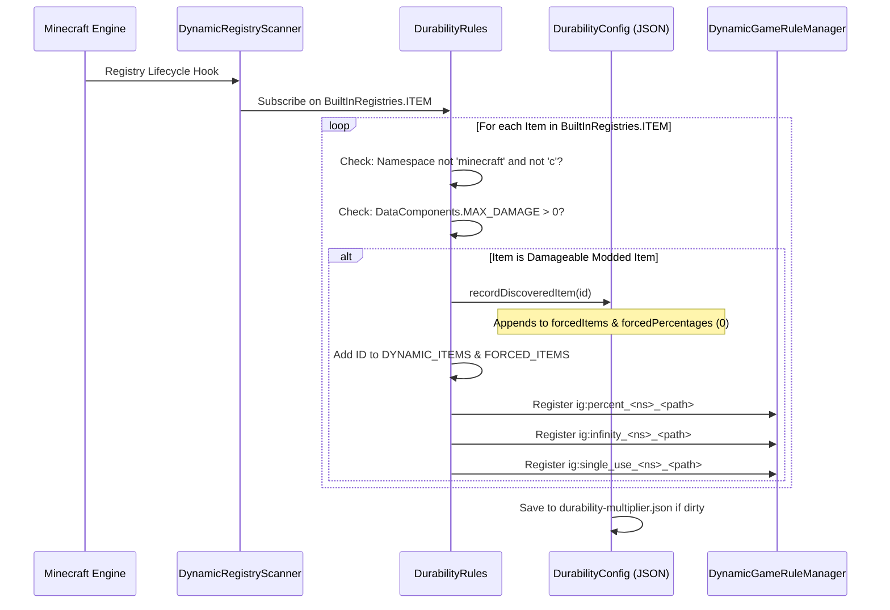

# 동적 모드 아이템 등록 (26.2)

| 시스템 매개변수 | 설정값 |
| :--- | :--- |
| **스캐너 엔진** | `DynamicRegistryScanner.subscribe(BuiltInRegistries.ITEM, ...)` |
| **내구도 조건** | `DataComponents.MAX_DAMAGE > 0` 또는 `forcedItems` 등록 항목 |
| **제외 네임스페이스** | `minecraft`, `c` (바닐라 및 관례 범주로 처리됨) |
| **동적 등록 목록** | `DurabilityRules.DYNAMIC_ITEMS` & `DurabilityRules.FORCED_ITEMS` |
| **생성 퍼센트 키** | `ig:percent_<namespace>_<path>` (최소 `-1`, 기본값 `0`) |
| **생성 신 모드 키** | `ig:infinity_<namespace>_<path>` (기본값 `false`) |
| **생성 1회용 키** | `ig:single_use_<namespace>_<path>` (기본값 `false`) |
| **자동 입력 대상** | `config/durability-multiplier.json` 내 `forcedItems` 목록 및 `forcedPercentages` 맵 |

---

## ⚡ 개요 및 목적

수많은 마인크래프트 모드가 표준 바닐라 아이템 클래스(`SwordItem`, `PickaxeItem`)를 상속하지 않고 바닐라 태그(`#minecraft:swords`)도 없는 커스텀 무기, 마법 지팡이, 에너지 도구를 추가합니다.

Durability Multiplier는 자율적인 **동적 아이템 등록 및 자동 입력 엔진**을 통해 이를 해결합니다. 내구도를 가진 모든 모드 아이템을 자동 감지하여 Tab 자동완성이 지원되는 게임 규칙에 등록하고, 시작 시 `config/durability-multiplier.json`에 즉시 반영합니다.

---

## 🔧 범용 3단계 감지 스캐너

다른 모드의 등록 시점과 관계없이 100% 탐색을 보장하기 위해 3단계 스캔 수명 주기를 구현합니다:



### 1. 1단계: 시작 시 스캔
모드 초기화 시점(`DurabilityRules.register()`)에 설정 파일에 명시된 아이템들을 즉시 스캔하여 동적 게임 규칙을 등록합니다.

### 2. 2단계: 실시간 등록 구독
`DynamicRegistryScanner`를 통해 `BuiltInRegistries.ITEM`을 구독합니다. 외부 모드가 새 아이템을 등록할 때마다 콜백이 검사를 수행합니다:
* 네임스페이스가 제외 대상이 아니고 내구도를 가지면 탐색된 것으로 표시됩니다.
* 아이템이 `forcedItems` 및 `forcedPercentages` (기본값 0)에 기록됩니다.
* 동적 게임 규칙이 즉석에서 실시간 생성됩니다.

### 3. 3단계: 서버 시작 안전 스캔
월드 로드 또는 서버 구동 시 최종 안전 점검을 거쳐 지연 로딩 모드의 아이템까지 완벽히 동기화합니다.

---

## 📖 단계별 방법 안내

### 사용법 1: `/gamerule` 명령어로 게임 내 모드 아이템 구성하기

탐색된 모든 모드 아이템은 3개의 전용 게임 규칙을 부여받습니다:
1. `ig:percent_<namespace>_<path>`: 내구도 퍼센트 설정 (`100` = 1배, `200` = 2배, `50` = 0.5배, `0` = 상속, `-1` = 1회용).
2. `ig:infinity_<namespace>_<path>`: 파괴 불가 신 모드 토글 (`true` / `false`).
3. `ig:single_use_<namespace>_<path>`: 1타 파괴 유리 모드 토글 (`true` / `false`).

#### 예시 명령어:
```mcfunction
# 1. Query the current percentage for a custom plasma cutter
/gamerule ig:percent_techmod_plasma_cutter

# 2. Give the plasma cutter 500% (5x) durability in the active world
/gamerule ig:percent_techmod_plasma_cutter 500

# 3. Make a magic wand completely unbreakable (God Mode)
/gamerule ig:infinity_magicmod_staff_of_fire true

# 4. Make an obsidian dagger break after a single use (Glass Mode)
/gamerule ig:single_use_customweapons_obsidian_dagger true

# 5. Reset the plasma cutter to inherit global/category settings
/gamerule ig:percent_techmod_plasma_cutter 0
```

> 💡 **즉각적인 Tab 자동완성**: `/gamerule ig:percent_` 또는 `/gamerule ig:infinity_`를 입력하고 `Tab`을 누르면 감지된 모든 모드 아이템이 즉시 자동완성됩니다!

---

### 사용법 2: `durability-multiplier.json`에서 모드 아이템 사전 구성하기

배포용 모드팩 제작자나 새 월드의 기본값을 미리 설정하려는 서버 관리자의 경우:

1. 모드가 설치된 상태로 게임을 한 번 실행하여 스캐너가 아이템을 감지하도록 합니다.
2. 텍스트 편집기에서 `config/durability-multiplier.json`을 엽니다.
3. `forcedPercentages`, `forcedInfinities`, `forcedSingleUses` 항목을 찾습니다.
4. 원하는 설정값을 입력합니다:

```json
{
  "configVersion": 2,
  "percentGlobal": 200,
  
  "forcedItems": [
    "techmod:plasma_cutter",
    "magicmod:staff_of_fire",
    "survivalmod:flint_knife"
  ],
  
  "forcedPercentages": {
    "techmod:plasma_cutter": 400,
    "survivalmod:flint_knife": 50
  },
  
  "forcedInfinities": {
    "magicmod:staff_of_fire": true
  },
  
  "forcedSingleUses": {}
}
```

5. 파일을 저장합니다. 이후 생성되는 모든 새 월드와 서버에 해당 기본값이 적용됩니다.

---

### 사용법 3: 고급 사용자를 위한 `-1` 유리 모드 센티널 값 사용하기

불리언 규칙인 `ig:single_use_<mod>_<item>`을 켜는 대신, 퍼센트 규칙에 직접 `-1`을 설정할 수도 있습니다:

```mcfunction
# Set the plasma cutter to 1-hit break mode using the percentage rule
/gamerule ig:percent_techmod_plasma_cutter -1
```

* **작동 원리**: 평가 엔진이 `getEffectivePercent(...) <= -1`을 확인하고, 참이면 `isSingleUse(...)`가 즉시 `true`를 반환합니다.
* **장점**: 슬라이더나 숫자 입력 인터페이스에서 직접 1회용 메커니즘을 설정할 수 있습니다.

