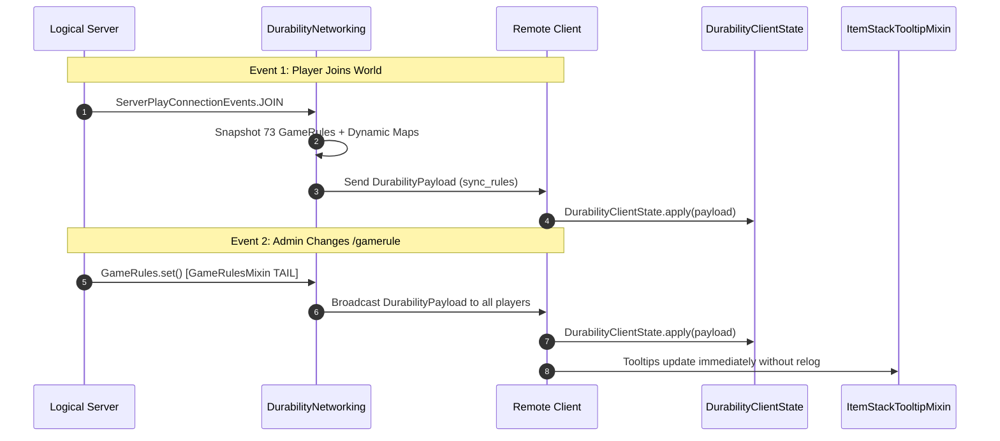

# 네트워크 동기화 및 페이로드 프로토콜 (26.2)

| 프로토콜 매개변수 | 값 |
| :--- | :--- |
| **채널 식별자** | `durability-multiplier:sync_rules` |
| **페이로드 클래스** | `net.instantgratification.durabilitymultiplier.network.DurabilityPayload` |
| **네트워크 매니저** | `net.instantgratification.durabilitymultiplier.network.DurabilityNetworking` |
| **클라이언트 상태 캐시** | `net.instantgratification.durabilitymultiplier.network.DurabilityClientState` |
| **코덱 유형** | `StreamCodec<FriendlyByteBuf, DurabilityPayload>` |
| **동기화 트리거** | 플레이어 접속 (`ServerPlayConnectionEvents.JOIN`) & 규칙 변경 (`GameRulesMixin`) |

---

## ⚡ 프로토콜 아키텍처

툴팁은 물리적 클라이언트에서 렌더링되지만 게임 규칙은 논리 서버에 존재합니다. Durability Multiplier는 Fabric Networking API를 사용하여 73개 정적 규칙 및 동적 규칙의 실시간 스냅샷을 클라이언트에 전송합니다.



---

## 📦 페이로드 구조 (76개 필드 및 동적 맵)

`DurabilityPayload`는 `FriendlyByteBuf`의 VarInt, Boolean 및 맵 코덱을 사용하여 모든 규칙을 효율적으로 직렬화합니다:

```java
public record DurabilityPayload(
    int percentGlobal,
    int percentWeapons,
    int percentSwords,
    int percentSpears,
    int percentTridents,
    int percentMaces,
    int percentBows,
    int percentCrossbows,
    int percentShields,
    int percentTools,
    int percentPickaxes,
    int percentAxes,
    int percentShovels,
    int percentHoes,
    int percentShears,
    int percentFishingRods,
    int percentBrushes,
    int percentFlintAndSteel,
    int percentArmor,
    int percentHelmets,
    int percentChestplates,
    int percentLeggings,
    int percentBoots,
    int percentElytra,
    
    boolean infinityGlobal,
    boolean infinityWeapons,
    boolean infinitySwords,
    boolean infinitySpears,
    boolean infinityTridents,
    boolean infinityMaces,
    boolean infinityBows,
    boolean infinityCrossbows,
    boolean infinityShields,
    boolean infinityTools,
    boolean infinityPickaxes,
    boolean infinityAxes,
    boolean infinityShovels,
    boolean infinityHoes,
    boolean infinityShears,
    boolean infinityFishingRods,
    boolean infinityBrushes,
    boolean infinityFlintAndSteel,
    boolean infinityArmor,
    boolean infinityHelmets,
    boolean infinityChestplates,
    boolean infinityLeggings,
    boolean infinityBoots,
    boolean infinityElytra,
    
    boolean singleUseGlobal,
    boolean singleUseWeapons,
    boolean singleUseSwords,
    boolean singleUseSpears,
    boolean singleUseTridents,
    boolean singleUseMaces,
    boolean singleUseBows,
    boolean singleUseCrossbows,
    boolean singleUseShields,
    boolean singleUseTools,
    boolean singleUsePickaxes,
    boolean singleUseAxes,
    boolean singleUseShovels,
    boolean singleUseHoes,
    boolean singleUseShears,
    boolean singleUseFishingRods,
    boolean singleUseBrushes,
    boolean singleUseFlintAndSteel,
    boolean singleUseArmor,
    boolean singleUseHelmets,
    boolean singleUseChestplates,
    boolean singleUseLeggings,
    boolean singleUseBoots,
    boolean singleUseElytra,

    boolean showTooltip,
    
    java.util.Map<String, Integer> dynamicPercentages,
    java.util.Map<String, Boolean> dynamicInfinities,
    java.util.Map<String, Boolean> dynamicSingleUses
) implements CustomPacketPayload
```
