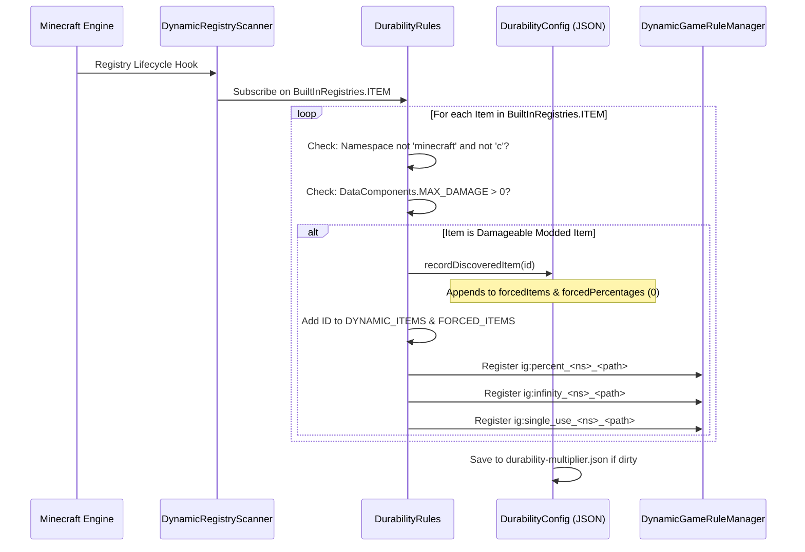

# Registro dinâmico de itens de mods (26.1.2)

| Parâmetro do Sistema | Valor |
| :--- | :--- |
| **Motor do Scanner** | `DynamicRegistryScanner.subscribe(BuiltInRegistries.ITEM, ...)` |
| **Condição de Durabilidade** | `DataComponents.MAX_DAMAGE > 0` ou entrada em `forcedItems` |
| **Namespaces Ignorados** | `minecraft`, `c` (tratados pelas categorias padrão e de convenção) |
| **Lista de Registro Dinâmico** | `DurabilityRules.DYNAMIC_ITEMS` e `DurabilityRules.FORCED_ITEMS` |
| **Chave de Porcentagem Gerada** | `ig:percent_<namespace>_<path>` (Mín `-1`, Padrão `0`) |
| **Chave de Modo Deus Gerada** | `ig:infinity_<namespace>_<path>` (Padrão `false`) |
| **Chave de Uso Único Gerada** | `ig:single_use_<namespace>_<path>` (Padrão `false`) |
| **Destino de Autopreenchimento** | Lista `forcedItems` e mapa `forcedPercentages` em `config/durability-multiplier.json` |

---

## ⚡ Visão geral e propósito

Muitos mods de Minecraft introduzem armas personalizadas, varinhas mágicas, ferramentas de energia ou mecanismos que **não** estendem as classes de itens padrão do vanilla (`SwordItem`, `PickaxeItem`) nem implementam tags vanilla (`#minecraft:swords`).

Durability Multiplier resolve isso por meio de um **Motor Autônomo de Registro Dinâmico e Autopreenchimento de Itens**. Qualquer item de mod com durabilidade é automaticamente detectado, registrado nas GameRules com autocompletar e salvo em `config/durability-multiplier.json` ao iniciar.

---

## 🔧 Scanner universal de descoberta em 3 níveis

O mod implementa um ciclo de vida de varredura de 3 níveis para garantir 100% de descoberta de itens, independentemente de quando outros mods registram seus itens:



### 1. Nível 1: Verificação na inicialização
Imediatamente na inicialização do mod (`DurabilityRules.register()`), o motor escaneia todos os itens declarados explicitamente em `config/durability-multiplier.json` e registra suas GameRules dinâmicas.

### 2. Nível 2: Inscrição de entradas dinâmicas
O mod se inscreve em `BuiltInRegistries.ITEM` via `DynamicRegistryScanner`. Sempre que um mod externo registra um novo item, o callback inspeciona o item:
* Se o namespace não for `minecraft` nem `c` e possuir `DataComponents.MAX_DAMAGE > 0`, é marcado como descoberto.
* O item é registrado em `forcedItems` e `forcedPercentages` (padrão `0`).
* As GameRules dinâmicas são criadas imediatamente em tempo real.

### 3. Nível 3: Verificação de segurança ao iniciar o servidor
Quando um mundo carrega ou um servidor inicia, uma etapa final garante que itens de datapacks ou mods tardios sejam capturados e sincronizados.

---

## 📖 Guias práticos passo a passo

### Guia 1: Configurando itens de mods no jogo via comandos `/gamerule`

Cada item de mod descoberto recebe três GameRules dedicadas:
1. `ig:percent_<namespace>_<path>`: Define a porcentagem (`100` = 1x vanilla, `200` = 2x, `50` = 0.5x, `0` = herda, `-1` = uso único).
2. `ig:infinity_<namespace>_<path>`: Alterna o Modo Deus inquebrável (`true` / `false`).
3. `ig:single_use_<namespace>_<path>`: Alterna o Modo Vidro de 1 golpe (`true` / `false`).

#### Exemplos de comandos:
```mcfunction
# 1. Query the current percentage for a custom plasma cutter
/gamerule ig:percent_techmod_plasma_cutter

# 2. Give the plasma cutter 500% (5x) durability in the active world
/gamerule ig:percent_techmod_plasma_cutter 500

# 3. Make a magic wand completely unbreakable (God Mode)
/gamerule ig:infinity_magicmod_staff_of_fire true

# 4. Make an obsidian dagger break after a single use (Glass Mode)
/gamerule ig:single_use_customweapons_obsidian_dagger true

# 5. Reset the plasma cutter to inherit global/category settings
/gamerule ig:percent_techmod_plasma_cutter 0
```

> 💡 **Autocompletar Instantâneo**: Digite `/gamerule ig:percent_` ou `/gamerule ig:infinity_` e pressione `Tab` para ver todos os itens descobertos!

---

### Guia 2: Pré-configurando itens de mods em `durability-multiplier.json`

Para autores de modpacks ou donos de servidores definindo padrões para mundos futuros:

1. Inicie o jogo uma vez com seus mods instalados para escanear todos os itens.
2. Abra `config/durability-multiplier.json` em qualquer editor de texto.
3. Localize os mapas `forcedPercentages`, `forcedInfinities` ou `forcedSingleUses`.
4. Defina os valores desejados:

```json
{
  "configVersion": 2,
  "percentGlobal": 200,
  
  "forcedItems": [
    "techmod:plasma_cutter",
    "magicmod:staff_of_fire",
    "survivalmod:flint_knife"
  ],
  
  "forcedPercentages": {
    "techmod:plasma_cutter": 400,
    "survivalmod:flint_knife": 50
  },
  
  "forcedInfinities": {
    "magicmod:staff_of_fire": true
  },
  
  "forcedSingleUses": {}
}
```

5. Salve o arquivo. Qualquer novo mundo ou servidor recém-criado usará esses padrões.

---

### Guia 3: Usando o sentinela de modo Vidro `-1` para usuários avançados

Em vez de alternar a regra booleana `ig:single_use_<mod>_<item>`, você pode definir diretamente `-1` em qualquer regra de porcentagem:

```mcfunction
# Set the plasma cutter to 1-hit break mode using the percentage rule
/gamerule ig:percent_techmod_plasma_cutter -1
```

* **Por que funciona**: O mecanismo avalia `getEffectivePercent(...) <= -1`. Se for true, `isSingleUse(...)` retorna `true` imediatamente.
* **Vantagem**: Permite configurar mecânicas de uso único diretamente em campos numéricos e controles deslizantes.

