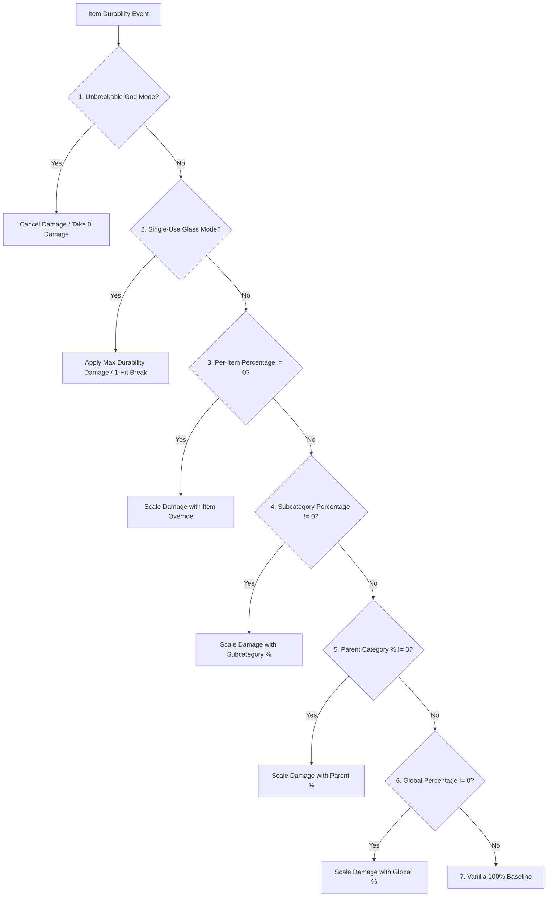

# Classificação de itens e compatibilidade com mods (26.2)

| Parâmetro do Sistema | Valor |
| :--- | :--- |
| **Método de Classificação** | `DurabilityHelper.classifyItem(ItemStack)` |
| **Motor de Cache** | `ConcurrentHashMap<Item, ItemCategory>` seguro para threads |
| **Categorias Suportadas** | 22 Categorias Distintas e Recuos |
| **Inspeção de Componentes** | `DataComponents.MAX_DAMAGE`, `EQUIPPABLE`, `TOOL`, `GLIDER` |
| **Inspeção de Tags** | `#minecraft:*` e `#c:*` (Tags Convencionais / Fabric) |
| **Filtro de Durabilidade** | `DataComponents.MAX_DAMAGE > 0` (Blocos e móveis estritamente filtrados) |

---

## 🔍 Filtragem estrita de durabilidade (`MAX_DAMAGE > 0`)

Para evitar poluição do registro e do namespace de GameRules, o Durability Multiplier impõe um pré-requisito estrito:

```java
public static boolean isItemDamageable(Item item) {
    if (item == null) return false;
    try {
        Identifier id = BuiltInRegistries.ITEM.getKey(item);
        if (id != null && (FORCED_ITEMS.contains(id) || DurabilityConfig.get().isForced(id.toString()))) {
            return true;
        }
        Integer maxDamage = item.components().get(DataComponents.MAX_DAMAGE);
        return maxDamage != null && maxDamage > 0;
    } catch (Throwable t) {
        return false;
    }
}
```

### Por que itens de mods sem dano são excluídos
* **Mods de Móveis** (ex. armários, cadeiras, mesas de Macaw's Furniture): Esses itens não possuem o componente `DataComponents.MAX_DAMAGE` porque são blocos colocáveis.
* **Blocos de Construção e Materiais**: Pedra, lingotes, gemas, madeira e itens de decoração são completamente ignorados pelo scanner.
* **Comida e Consumíveis**: Consumíveis têm pilhas $> 1$ e zero durabilidade.
* **Benefício de Desempenho**: A pré-filtragem elimina ~95% dos itens em $0.0001\mu\text{s}$ na inicialização, assegurando zero sobrecarga.

---

## 👑 Hierarquia completa de avaliação e precedência

Quando um item passa pelo cálculo de durabilidade, `DurabilityHelper` executa a seguinte sequência estrita de avaliação em 7 níveis:



### Detalhamento de prioridades:
1. **Modo Deus Inquebrável (`isInfinite`)**:
   * Per-Item Override (`ig:infinity_<mod>_<item>` / `forcedInfinities`) $\rightarrow$ Subcategory (`ig:dm_infinity_pickaxes`) $\rightarrow$ Parent Category (`ig:dm_infinity_tools`) $\rightarrow$ Global (`ig:dm_infinity_global`).
2. **Modo Vidro de Uso Único (`isSingleUse`)**:
   * `-1` Sentinel in percentage rule $\rightarrow$ Per-Item (`ig:single_use_<mod>_<item>`) $\rightarrow$ Subcategory $\rightarrow$ Parent Category $\rightarrow$ Global.
3. **Substituição de Porcentagem por Item**:
   * `ig:percent_<mod>_<item>` or `forcedPercentages` (if $\neq 0$).
4. **Porcentagem de Subcategoria Específica**:
   * `ig:dm_percent_swords`, `ig:dm_percent_pickaxes`, `ig:dm_percent_helmets`, etc. (if $\neq 0$).
5. **Porcentagem de Categoria Pai**:
   * Tools parent (`ig:dm_percent_tools`), Weapons parent (`ig:dm_percent_weapons`), Armor parent (`ig:dm_percent_armor`) (if $\neq 0$).
6. **Porcentagem Global**:
   * `ig:dm_percent_global` (if $\neq 0$).
7. **Base Padrão do Vanilla**:
   * Default $100\%$ ($1\times$ vanilla durability).

---

## 📦 Critérios de correspondência de categoria e itens suportados

### 1. Armas
* **Espadas (`ItemCategory.SWORD`)**: `#minecraft:swords`, `#c:swords`, `#c:melee_weapons`, `SwordItem`.
* **Lanças (`ItemCategory.SPEAR`)**: `#minecraft:spears`, `#c:spears`.
* **Tridentes (`ItemCategory.TRIDENT`)**: `Items.TRIDENT`, `#c:tridents`, `TridentItem`.
* **Maças (`ItemCategory.MACE`)**: `Items.MACE`, `#c:maces`, `MaceItem`.
* **Arcos (`ItemCategory.BOW`)**: `Items.BOW`, `#c:bows`, `BowItem`.
* **Bestas (`ItemCategory.CROSSBOW`)**: `Items.CROSSBOW`, `#c:crossbows`, `CrossbowItem`.
* **Escudos (`ItemCategory.SHIELD`)**: `Items.SHIELD`, `#c:shields`, `ShieldItem`.

### 2. Ferramentas e utilitários
* **Picaretas (`ItemCategory.PICKAXE`)**: `#minecraft:pickaxes`, `#c:pickaxes`, `PickaxeItem`.
* **Machados (`ItemCategory.AXE`)**: `#minecraft:axes`, `#c:axes`, `AxeItem`.
* **Pás (`ItemCategory.SHOVEL`)**: `#minecraft:shovels`, `#c:shovels`, `ShovelItem`.
* **Enxadas (`ItemCategory.HOE`)**: `#minecraft:hoes`, `#c:hoes`, `HoeItem`.
* **Tesouras (`ItemCategory.SHEARS`)**: `Items.SHEARS`, `#c:shears`, `ShearsItem`.
* **Varas de Pescar (`ItemCategory.FISHING_ROD`)**: `Items.FISHING_ROD`, `FishingRodItem`.
* **Pincéis (`ItemCategory.BRUSH`)**: `Items.BRUSH`, `BrushItem`.
* **Pederneiras (`ItemCategory.FLINT_AND_STEEL`)**: `Items.FLINT_AND_STEEL`, `FlintAndSteelItem`.
* **Ferramentas Globais (`ItemCategory.TOOL_GLOBAL`)**: Qualquer item restante com `DataComponents.TOOL` ou `#c:tools`.

### 3. Armaduras e vestíveis
* **Capacetes (`ItemCategory.HELMET`)**: `#minecraft:head_armor`, `#c:helmets`, `Equippable` (CABEÇA).
* **Peitorais (`ItemCategory.CHESTPLATE`)**: `#minecraft:chest_armor`, `#c:chestplates`, `Equippable` (PEITO).
* **Calças (`ItemCategory.LEGGINGS`)**: `#minecraft:leg_armor`, `#c:leggings`, `Equippable` (PERNAS).
* **Botas (`ItemCategory.BOOTS`)**: `#minecraft:foot_armor`, `#c:boots`, `Equippable` (PÉS).
* **Élitros (`ItemCategory.ELYTRA`)**: `Items.ELYTRA`, `DataComponents.GLIDER`.

### 4. Outros / Itens de mods (`ItemCategory.OTHER`)
* Qualquer item com durabilidade que não corresponda às tags ou componentes padrão é atribuído a `OTHER` e gerenciado pelo [[Scanner Dinâmico|pt_br-26.2-Dynamic-Modded-Item-Registration]].

