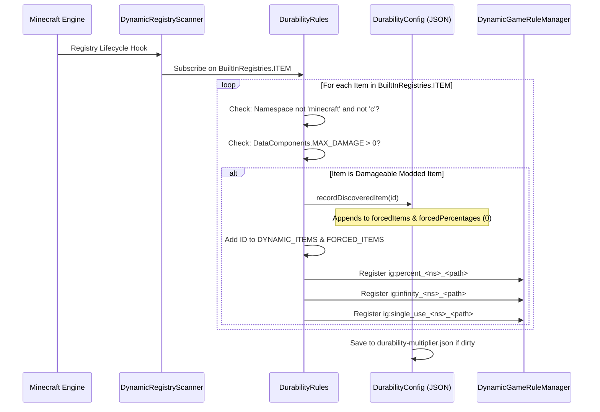

# Динамическая регистрация предметов из модов (26.1.2)

| Системный параметр | Значение |
| :--- | :--- |
| **Движок сканера** | `DynamicRegistryScanner.subscribe(BuiltInRegistries.ITEM, ...)` |
| **Условие прочности** | `DataComponents.MAX_DAMAGE > 0` или запись в `forcedItems` |
| **Игнорируемые пространства имен** | `minecraft`, `c` (обрабатываются стандартными категориями) |
| **Список динамического реестра** | `DurabilityRules.DYNAMIC_ITEMS` и `DurabilityRules.FORCED_ITEMS` |
| **Сгенерированный ключ процента** | `ig:percent_<namespace>_<path>` (мин. `-1`, по умолч. `0`) |
| **Сгенерированный ключ Режима бога** | `ig:infinity_<namespace>_<path>` (по умолч. `false`) |
| **Сгенерированный ключ одноразовости** | `ig:single_use_<namespace>_<path>` (по умолч. `false`) |
| **Цель автозаполнения** | Список `forcedItems` и карта `forcedPercentages` в `config/durability-multiplier.json` |

---

## ⚡ Обзор и назначение

Многие моды для Minecraft добавляют собственное оружие, магические жезлы, энергетические инструменты или механизмы, которые **не** расширяют стандартные ванильные классы (`SwordItem`, `PickaxeItem`) и не содержат ванильных тегов (`#minecraft:swords`).

Durability Multiplier решает эту проблему с помощью автономного **движка динамической регистрации предметов и автозаполнения**. Любой модовый предмет с прочностью автоматически обнаруживается, регистрируется в системе GameRules с автодополнением по Tab и сохраняется в `config/durability-multiplier.json` при запуске.

---

## 🔧 Универсальный 3-уровневый сканер обнаружения

Мод реализует 3-уровневый жизненный цикл сканирования для 100% обнаружения предметов независимо от момента регистрации другими модами:



### 1. Уровень 1: Сканирование при запуске
Сразу при инициализации мода (`DurabilityRules.register()`) движок сканирует все явно объявленные предметы из `config/durability-multiplier.json` и регистрирует их динамические GameRules.

### 2. Уровень 2: Подписка на динамическую регистрацию
Мод подписывается на `BuiltInRegistries.ITEM` через `DynamicRegistryScanner`. Всякий раз, когда сторонний мод регистрирует новый предмет, коллбэк проверяет его:
* Если пространство имен не `minecraft` и не `c`, и предмет имеет `DataComponents.MAX_DAMAGE > 0`, он отмечается как обнаруженный.
* Предмет записывается в `forcedItems` и `forcedPercentages` (по умолчанию `0`).
* Динамические GameRules создаются мгновенно «на лету».

### 3. Уровень 3: Защитное сканирование при старте сервера
При загрузке мира или запуске сервера финальный защитный проход гарантирует захват и синхронизацию поздно зарегистрированных предметов.

---

## 📖 Пошаговые руководства

### Руководство 1: Настройка модовых предметов в игре с помощью команд `/gamerule`

Каждый обнаруженный модовый предмет получает три персональных правила GameRules:
1. `ig:percent_<namespace>_<path>`: Задает процент прочности (`100` = 1x ваниль, `200` = 2x, `50` = 0.5x, `0` = наследование, `-1` = одноразовый).
2. `ig:infinity_<namespace>_<path>`: Переключает Режим бога (`true` / `false`).
3. `ig:single_use_<namespace>_<path>`: Переключает Стеклянный режим (`true` / `false`).

#### Примеры команд:
```mcfunction
# 1. Query the current percentage for a custom plasma cutter
/gamerule ig:percent_techmod_plasma_cutter

# 2. Give the plasma cutter 500% (5x) durability in the active world
/gamerule ig:percent_techmod_plasma_cutter 500

# 3. Make a magic wand completely unbreakable (God Mode)
/gamerule ig:infinity_magicmod_staff_of_fire true

# 4. Make an obsidian dagger break after a single use (Glass Mode)
/gamerule ig:single_use_customweapons_obsidian_dagger true

# 5. Reset the plasma cutter to inherit global/category settings
/gamerule ig:percent_techmod_plasma_cutter 0
```

> 💡 **Мгновенное автодополнение по Tab**: Введите `/gamerule ig:percent_` или `/gamerule ig:infinity_` и нажмите `Tab`, чтобы увидеть все обнаруженные предметы!

---

### Руководство 2: Предварительная настройка модовых предметов в `durability-multiplier.json`

Для авторов сборок модов или владельцев серверов, настраивающих значения по умолчанию:

1. Запустите игру один раз с установленными модами, чтобы модуль автозаполнения просканировал все предметы.
2. Откройте `config/durability-multiplier.json` в любом текстовом редакторе.
3. Найдите таблицы `forcedPercentages`, `forcedInfinities` или `forcedSingleUses`.
4. Установите желаемые значения:

```json
{
  "configVersion": 2,
  "percentGlobal": 200,
  
  "forcedItems": [
    "techmod:plasma_cutter",
    "magicmod:staff_of_fire",
    "survivalmod:flint_knife"
  ],
  
  "forcedPercentages": {
    "techmod:plasma_cutter": 400,
    "survivalmod:flint_knife": 50
  },
  
  "forcedInfinities": {
    "magicmod:staff_of_fire": true
  },
  
  "forcedSingleUses": {}
}
```

5. Сохраните файл. Любой новый одиночный мир или вновь созданный сервер будет использовать эти базовые значения.

---

### Руководство 3: Использование специального значения `-1` (стеклянный режим) для опытных пользователей

Вместо переключения логического правила `ig:single_use_<mod>_<item>` вы можете напрямую установить `-1` в процентном правиле:

```mcfunction
# Set the plasma cutter to 1-hit break mode using the percentage rule
/gamerule ig:percent_techmod_plasma_cutter -1
```

* **Почему это работает**: Движок проверки вычисляет `getEffectivePercent(...) <= -1`. Если да, `isSingleUse(...)` сразу возвращает `true`.
* **Преимущество**: Позволяет настраивать одноразовую механику напрямую из числовых полей и ползунков интерфейса.

