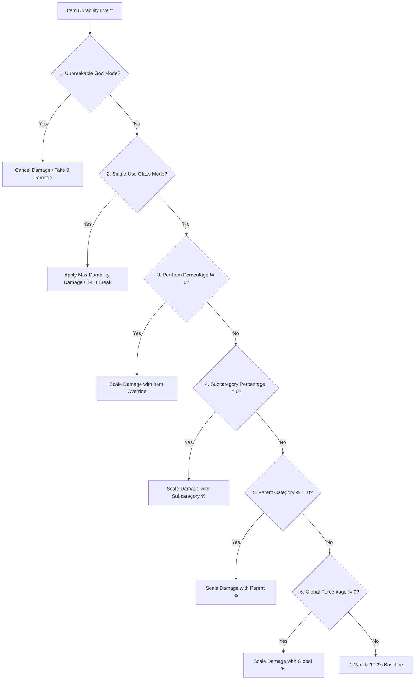

# Классификация предметов и совместимость с модами (26.1.2)

| Системный параметр | Значение |
| :--- | :--- |
| **Метод классификации** | `DurabilityHelper.classifyItem(ItemStack)` |
| **Движок кэширования** | Потокобезопасный `ConcurrentHashMap<Item, ItemCategory>` |
| **Поддерживаемые категории** | 22 отдельные категории и механизмы отката |
| **Проверка компонентов** | `DataComponents.MAX_DAMAGE`, `EQUIPPABLE`, `TOOL`, `GLIDER` |
| **Проверка тегов** | `#minecraft:*` и `#c:*` (теги конвенций Fabric) |
| **Фильтр прочности** | `DataComponents.MAX_DAMAGE > 0` (блоки и мебель строго отфильтрованы) |

---

## 🔍 Строгая фильтрация прочности (`MAX_DAMAGE > 0`)

Чтобы предотвратить засорение реестра и пространства имен GameRules, Durability Multiplier применяет строгое предварительное условие прочности:

```java
public static boolean isItemDamageable(Item item) {
    if (item == null) return false;
    try {
        Identifier id = BuiltInRegistries.ITEM.getKey(item);
        if (id != null && (FORCED_ITEMS.contains(id) || DurabilityConfig.get().isForced(id.toString()))) {
            return true;
        }
        Integer maxDamage = item.components().get(DataComponents.MAX_DAMAGE);
        return maxDamage != null && maxDamage > 0;
    } catch (Throwable t) {
        return false;
    }
}
```

### Почему неповреждаемые предметы из модов исключаются
* **Моды на мебель** (например, гардеробы, стулья, столы, двери от Macaw's Furniture): эти предметы не имеют компонента `DataComponents.MAX_DAMAGE`, поскольку являются блоками, а не расходуемыми инструментами.
* **Строительные блоки и материалы**: Камень, слитки, самоцветы, древесина и декоративные предметы полностью игнорируются сканером.
* **Еда и расходники**: Расходные предметы имеют размер стака $> 1$ и нулевую прочность.
* **Преимущество производительности**: Предварительная фильтрация отсеивает около 95% предметов игры за $0.0001\mu\text{s}$ при запуске, исключая накладные расходы.

---

## 👑 Полная иерархия вычисления и приоритета

Когда предмет проходит расчет прочности, `DurabilityHelper` выполняет следующую строгую 7-уровневую последовательность оценки:



### Разбор приоритетов:
1. **Режим бога (неразрушимость) (`isInfinite`)**:
   * Per-Item Override (`ig:infinity_<mod>_<item>` / `forcedInfinities`) $\rightarrow$ Subcategory (`ig:dm_infinity_pickaxes`) $\rightarrow$ Parent Category (`ig:dm_infinity_tools`) $\rightarrow$ Global (`ig:dm_infinity_global`).
2. **Стеклянный режим (одноразовость) (`isSingleUse`)**:
   * `-1` Sentinel in percentage rule $\rightarrow$ Per-Item (`ig:single_use_<mod>_<item>`) $\rightarrow$ Subcategory $\rightarrow$ Parent Category $\rightarrow$ Global.
3. **Переопределение процента для отдельного предмета**:
   * `ig:percent_<mod>_<item>` or `forcedPercentages` (if $\neq 0$).
4. **Процент конкретной подкатегории**:
   * `ig:dm_percent_swords`, `ig:dm_percent_pickaxes`, `ig:dm_percent_helmets`, etc. (if $\neq 0$).
5. **Процент родительской категории**:
   * Tools parent (`ig:dm_percent_tools`), Weapons parent (`ig:dm_percent_weapons`), Armor parent (`ig:dm_percent_armor`) (if $\neq 0$).
6. **Глобальный процент**:
   * `ig:dm_percent_global` (if $\neq 0$).
7. **Ванильный базовый уровень**:
   * Default $100\%$ ($1\times$ vanilla durability).

---

## 📦 Критерии сопоставления категорий и поддерживаемые предметы

### 1. Оружие
* **Мечи (`ItemCategory.SWORD`)**: `#minecraft:swords`, `#c:swords`, `#c:melee_weapons`, `SwordItem`.
* **Копья (`ItemCategory.SPEAR`)**: `#minecraft:spears`, `#c:spears`.
* **Трезубцы (`ItemCategory.TRIDENT`)**: `Items.TRIDENT`, `#c:tridents`, `TridentItem`.
* **Булавы (`ItemCategory.MACE`)**: `Items.MACE`, `#c:maces`, `MaceItem`.
* **Луки (`ItemCategory.BOW`)**: `Items.BOW`, `#c:bows`, `BowItem`.
* **Арбалеты (`ItemCategory.CROSSBOW`)**: `Items.CROSSBOW`, `#c:crossbows`, `CrossbowItem`.
* **Щиты (`ItemCategory.SHIELD`)**: `Items.SHIELD`, `#c:shields`, `ShieldItem`.

### 2. Инструменты и утилиты
* **Кирки (`ItemCategory.PICKAXE`)**: `#minecraft:pickaxes`, `#c:pickaxes`, `PickaxeItem`.
* **Топоры (`ItemCategory.AXE`)**: `#minecraft:axes`, `#c:axes`, `AxeItem`.
* **Лопаты (`ItemCategory.SHOVEL`)**: `#minecraft:shovels`, `#c:shovels`, `ShovelItem`.
* **Мотыги (`ItemCategory.HOE`)**: `#minecraft:hoes`, `#c:hoes`, `HoeItem`.
* **Ножницы (`ItemCategory.SHEARS`)**: `Items.SHEARS`, `#c:shears`, `ShearsItem`.
* **Удочки (`ItemCategory.FISHING_ROD`)**: `Items.FISHING_ROD`, `FishingRodItem`.
* **Кисти (`ItemCategory.BRUSH`)**: `Items.BRUSH`, `BrushItem`.
* **Огнива (`ItemCategory.FLINT_AND_STEEL`)**: `Items.FLINT_AND_STEEL`, `FlintAndSteelItem`.
* **Общие инструменты (`ItemCategory.TOOL_GLOBAL`)**: Любой оставшийся предмет с `DataComponents.TOOL` или `#c:tools`.

### 3. Броня и носимые предметы
* **Шлемы (`ItemCategory.HELMET`)**: `#minecraft:head_armor`, `#c:helmets`, `Equippable` (голова).
* **Нагрудники (`ItemCategory.CHESTPLATE`)**: `#minecraft:chest_armor`, `#c:chestplates`, `Equippable` (грудь).
* **Поножи (`ItemCategory.LEGGINGS`)**: `#minecraft:leg_armor`, `#c:leggings`, `Equippable` (ноги).
* **Ботинки (`ItemCategory.BOOTS`)**: `#minecraft:foot_armor`, `#c:boots`, `Equippable` (ступни).
* **Элитры (`ItemCategory.ELYTRA`)**: `Items.ELYTRA`, `DataComponents.GLIDER`.

### 4. Прочие / модовые предметы (`ItemCategory.OTHER`)
* Любой предмет с прочностью, не подходящий под стандартные теги или компоненты, относится к `OTHER` и управляется динамически через [[Динамический сканер|ru_ru-26.1.2-Dynamic-Modded-Item-Registration]].

