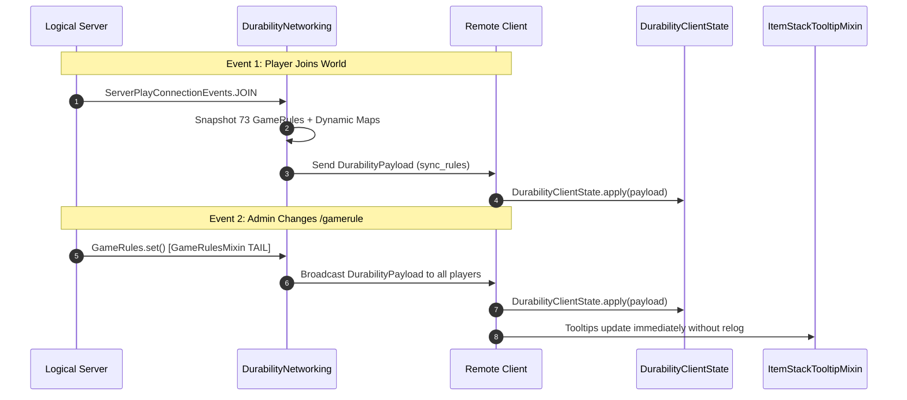

# Сетевая синхронизация и протокол данных (26.2)

| Параметр протокола | Значение |
| :--- | :--- |
| **Идентификатор канала** | `durability-multiplier:sync_rules` |
| **Класс пакета данных** | `net.instantgratification.durabilitymultiplier.network.DurabilityPayload` |
| **Сетевой менеджер** | `net.instantgratification.durabilitymultiplier.network.DurabilityNetworking` |
| **Кэш состояния клиента** | `net.instantgratification.durabilitymultiplier.network.DurabilityClientState` |
| **Тип кодека** | `StreamCodec<FriendlyByteBuf, DurabilityPayload>` |
| **Триггеры синхронизации** | Вход игрока (`ServerPlayConnectionEvents.JOIN`) и изменение GameRule (`GameRulesMixin`) |

---

## ⚡ Архитектура протокола

Поскольку подсказки отображаются на физическом клиенте, а GameRules существуют на логическом сервере, Durability Multiplier использует Fabric Networking API для отправки клиентам снимков всех 73 статических и динамических правил.



---

## 📦 Структура пакета данных (76 полей и динамические таблицы)

`DurabilityPayload` эффективно сериализует все GameRules и динамические таблицы с помощью VarInt, Boolean и кодеков карт `FriendlyByteBuf`:

```java
public record DurabilityPayload(
    int percentGlobal,
    int percentWeapons,
    int percentSwords,
    int percentSpears,
    int percentTridents,
    int percentMaces,
    int percentBows,
    int percentCrossbows,
    int percentShields,
    int percentTools,
    int percentPickaxes,
    int percentAxes,
    int percentShovels,
    int percentHoes,
    int percentShears,
    int percentFishingRods,
    int percentBrushes,
    int percentFlintAndSteel,
    int percentArmor,
    int percentHelmets,
    int percentChestplates,
    int percentLeggings,
    int percentBoots,
    int percentElytra,
    
    boolean infinityGlobal,
    boolean infinityWeapons,
    boolean infinitySwords,
    boolean infinitySpears,
    boolean infinityTridents,
    boolean infinityMaces,
    boolean infinityBows,
    boolean infinityCrossbows,
    boolean infinityShields,
    boolean infinityTools,
    boolean infinityPickaxes,
    boolean infinityAxes,
    boolean infinityShovels,
    boolean infinityHoes,
    boolean infinityShears,
    boolean infinityFishingRods,
    boolean infinityBrushes,
    boolean infinityFlintAndSteel,
    boolean infinityArmor,
    boolean infinityHelmets,
    boolean infinityChestplates,
    boolean infinityLeggings,
    boolean infinityBoots,
    boolean infinityElytra,
    
    boolean singleUseGlobal,
    boolean singleUseWeapons,
    boolean singleUseSwords,
    boolean singleUseSpears,
    boolean singleUseTridents,
    boolean singleUseMaces,
    boolean singleUseBows,
    boolean singleUseCrossbows,
    boolean singleUseShields,
    boolean singleUseTools,
    boolean singleUsePickaxes,
    boolean singleUseAxes,
    boolean singleUseShovels,
    boolean singleUseHoes,
    boolean singleUseShears,
    boolean singleUseFishingRods,
    boolean singleUseBrushes,
    boolean singleUseFlintAndSteel,
    boolean singleUseArmor,
    boolean singleUseHelmets,
    boolean singleUseChestplates,
    boolean singleUseLeggings,
    boolean singleUseBoots,
    boolean singleUseElytra,

    boolean showTooltip,
    
    java.util.Map<String, Integer> dynamicPercentages,
    java.util.Map<String, Boolean> dynamicInfinities,
    java.util.Map<String, Boolean> dynamicSingleUses
) implements CustomPacketPayload
```
