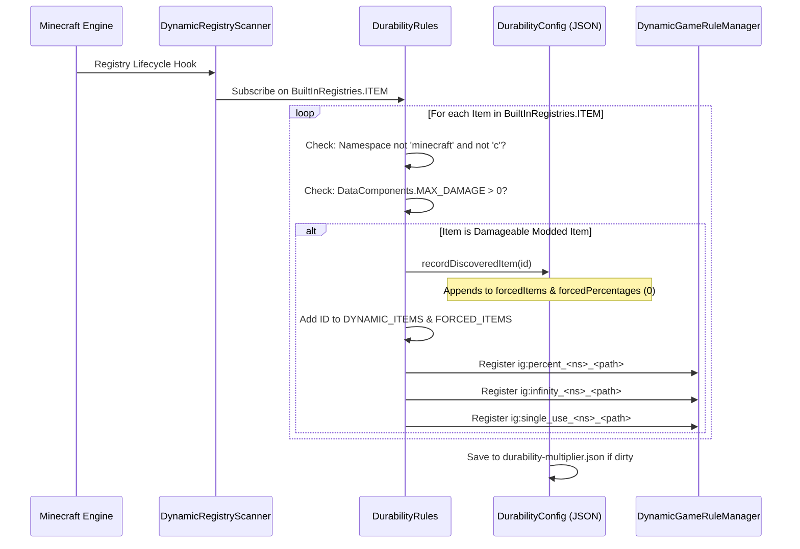

# 动态模组物品注册 (26.1.2)

| 系统参数 | 取值 |
| :--- | :--- |
| **扫描引擎** | `DynamicRegistryScanner.subscribe(BuiltInRegistries.ITEM, ...)` |
| **耐久判定条件** | `DataComponents.MAX_DAMAGE > 0` 或存在于 `forcedItems` 列表中 |
| **忽略的命名空间** | `minecraft`, `c`（已通过原版与通用规范分类处理） |
| **动态注册列表** | `DurabilityRules.DYNAMIC_ITEMS` 与 `DurabilityRules.FORCED_ITEMS` |
| **生成的百分比规则** | `ig:percent_<namespace>_<path>` (下限 `-1`, 默认 `0`) |
| **生成的上帝模式规则** | `ig:infinity_<namespace>_<path>` (默认 `false`) |
| **生成的单次使用规则** | `ig:single_use_<namespace>_<path>` (默认 `false`) |
| **自动填充目标** | `config/durability-multiplier.json` 中的 `forcedItems` 列表与 `forcedPercentages` 映射表 |

---

## ⚡ 概述与设计目的

许多 Minecraft 模组引入了自定义武器、魔法法杖、能量工具或机械设备，它们**并未**继承原版标准物品类 (`SwordItem`, `PickaxeItem`)，也未挂载原版物品标签 (`#minecraft:swords`)。

Durability Multiplier 通过自主的**动态物品注册与自动填充引擎**彻底解决了这一难题。任何可损耗的模组物品都会被自动检测，注册进游戏内拥有完整 Tab 补全的 GameRule 系统，并在启动时直接写入 `config/durability-multiplier.json`。

---

## 🔧 通用 3 级发现扫描器

本模组实现了 3 级扫描生命周期，无论外部模组何时注册其物品，均能确保 100% 发现识别：



### 1. 第 1 级：启动扫描
在模组初始化阶段 (`DurabilityRules.register()`)，引擎立即扫描 `config/durability-multiplier.json` 中显式声明的所有物品并注册其动态游戏规则。

### 2. 第 2 级：动态注册订阅
模组通过 `DynamicRegistryScanner` 订阅 `BuiltInRegistries.ITEM`。每当外部模组注册新物品时，回调即刻检查该物品：
* 若物品命名空间非 `minecraft` 或 `c`，且具备 `DataComponents.MAX_DAMAGE > 0`，则被标记为已发现。
* 该物品被记录至 `forcedItems` 和 `forcedPercentages` 中（默认 `0`）。
* 即时动态创建专属游戏规则。

### 3. 第 3 级：服务器启动兜底扫描
当世界加载或服务器启动时，最后一轮安全兜底扫描可确保捕获并同步由数据包或迟加载模组注册的物品。

---

## 📖 分步操作指南

### 操作指南 1：在游戏内通过 `/gamerule` 指令配置模组物品

每个被发现的模组物品均获得三项专属游戏规则：
1. `ig:percent_<namespace>_<path>`: 设置耐久百分比 (`100` = 1x 原版, `200` = 2x, `50` = 0.5x, `0` = 继承父分类/全局, `-1` = 单次使用)。
2. `ig:infinity_<namespace>_<path>`: 切换无法破坏的上帝模式 (`true` / `false`)。
3. `ig:single_use_<namespace>_<path>`: 切换 1 次命中破碎的玻璃模式 (`true` / `false`)。

#### 示例指令：
```mcfunction
# 1. Query the current percentage for a custom plasma cutter
/gamerule ig:percent_techmod_plasma_cutter

# 2. Give the plasma cutter 500% (5x) durability in the active world
/gamerule ig:percent_techmod_plasma_cutter 500

# 3. Make a magic wand completely unbreakable (God Mode)
/gamerule ig:infinity_magicmod_staff_of_fire true

# 4. Make an obsidian dagger break after a single use (Glass Mode)
/gamerule ig:single_use_customweapons_obsidian_dagger true

# 5. Reset the plasma cutter to inherit global/category settings
/gamerule ig:percent_techmod_plasma_cutter 0
```

> 💡 **即时 Tab 补全**：输入 `/gamerule ig:percent_` 或 `/gamerule ig:infinity_` 并按下 `Tab` 键，即可立即看到所有发现的模组物品自动补全！

---

### 操作指南 2：在 `durability-multiplier.json` 中预先配置模组物品

对于制作分发整合包的作者或为主机所有未来世界预设默认值的服主：

1. 安装所有模组后启动一次游戏，使自动填充引擎完整扫描所有物品。
2. 在任意文本编辑器中打开 `config/durability-multiplier.json`。
3. 定位 `forcedPercentages`、`forcedInfinities` 或 `forcedSingleUses` 映射表。
4. 填入期望的预设数值：

```json
{
  "configVersion": 2,
  "percentGlobal": 200,
  
  "forcedItems": [
    "techmod:plasma_cutter",
    "magicmod:staff_of_fire",
    "survivalmod:flint_knife"
  ],
  
  "forcedPercentages": {
    "techmod:plasma_cutter": 400,
    "survivalmod:flint_knife": 50
  },
  
  "forcedInfinities": {
    "magicmod:staff_of_fire": true
  },
  
  "forcedSingleUses": {}
}
```

5. 保存文件。任何新建的单人世界或全新创建的服务器都将采用这些基线默认值。

---

### 操作指南 3：使用高级用户 `-1` 玻璃模式哨兵值

除了切换布尔型的 `ig:single_use_<mod>_<item>` 规则，你也可以直接在任何百分比规则上填入 `-1`：

```mcfunction
# Set the plasma cutter to 1-hit break mode using the percentage rule
/gamerule ig:percent_techmod_plasma_cutter -1
```

* **工作原理**: 判定引擎检查 `getEffectivePercent(...) <= -1`。若为 true，`isSingleUse(...)` 立即返回 `true`。
* **优势**: 允许直接从数值配置输入框或滑块界面设置单次使用机制。

