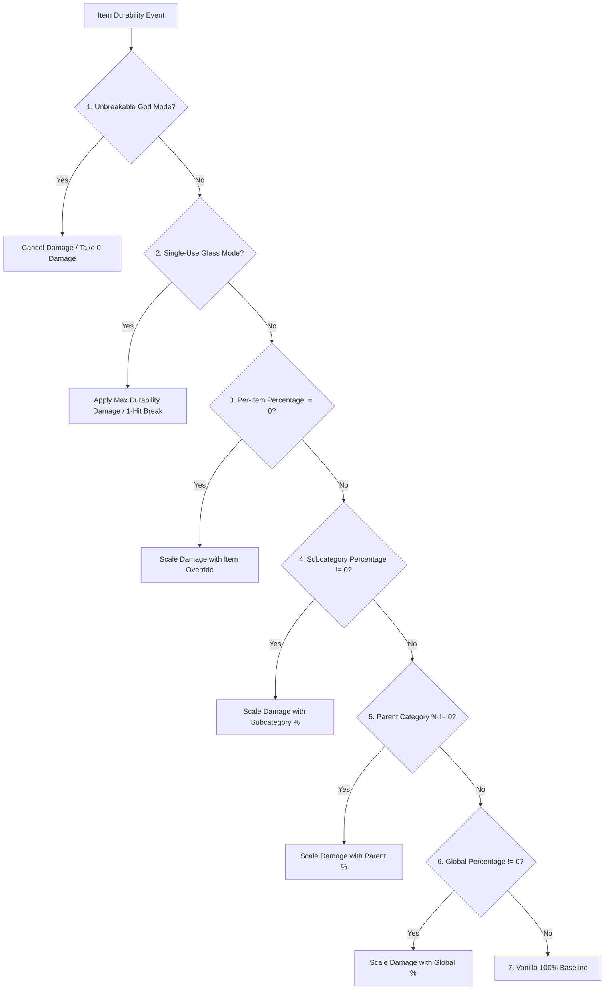

# 物品分类与模组兼容性 (26.2)

| 系统参数 | 取值 |
| :--- | :--- |
| **分类判定方法** | `DurabilityHelper.classifyItem(ItemStack)` |
| **缓存引擎** | 线程安全的 `ConcurrentHashMap<Item, ItemCategory>` |
| **受支持分类** | 22 个独立细分类别与回退机制 |
| **组件检查** | `DataComponents.MAX_DAMAGE`, `EQUIPPABLE`, `TOOL`, `GLIDER` |
| **标签检查** | `#minecraft:*` 与 `#c:*` (约定 / Fabric 标签) |
| **耐久门禁过滤** | `DataComponents.MAX_DAMAGE > 0` (方块与家具等严格过滤) |

---

## 🔍 严格耐久度过滤 (`MAX_DAMAGE > 0`)

为防止注册表冗余和游戏规则命名空间污染，Durability Multiplier 实施了严格的耐久度前置条件：

```java
public static boolean isItemDamageable(Item item) {
    if (item == null) return false;
    try {
        Identifier id = BuiltInRegistries.ITEM.getKey(item);
        if (id != null && (FORCED_ITEMS.contains(id) || DurabilityConfig.get().isForced(id.toString()))) {
            return true;
        }
        Integer maxDamage = item.components().get(DataComponents.MAX_DAMAGE);
        return maxDamage != null && maxDamage > 0;
    } catch (Throwable t) {
        return false;
    }
}
```

### 为什么无损耗模组物品会被排除
* **家具模组**（例如 Macaw's Furniture 的衣柜、椅子、桌子、门）：这些物品不包含 `DataComponents.MAX_DAMAGE` 组件，因为它们属于可放置方块而非易磨损工具。
* **建筑方块与材料**: 石头、锭、宝石、木材和装饰物品会被扫描器完全忽略。
* **食物与消耗品**: 消耗品堆叠上限 $> 1$ 且耐久为零。
* **性能优势**: 预过滤在启动扫描期间以 $0.0001\mu\text{s}$ 的速度剔除约 95% 的游戏物品，确保零性能开销并在指令中提供清晰的自动补全建议。

---

## 👑 完整判定求值与优先级层级

当物品进行耐久度计算时，`DurabilityHelper` 会执行以下严格的 7 级评估序列：



### 优先级详解：
1. **无法破坏上帝模式 (`isInfinite`)**：
   * Per-Item Override (`ig:infinity_<mod>_<item>` / `forcedInfinities`) $\rightarrow$ Subcategory (`ig:dm_infinity_pickaxes`) $\rightarrow$ Parent Category (`ig:dm_infinity_tools`) $\rightarrow$ Global (`ig:dm_infinity_global`).
2. **单次使用玻璃模式 (`isSingleUse`)**：
   * `-1` Sentinel in percentage rule $\rightarrow$ Per-Item (`ig:single_use_<mod>_<item>`) $\rightarrow$ Subcategory $\rightarrow$ Parent Category $\rightarrow$ Global.
3. **单品百分比覆盖**：
   * `ig:percent_<mod>_<item>` or `forcedPercentages` (if $\neq 0$).
4. **细分子分类百分比**：
   * `ig:dm_percent_swords`, `ig:dm_percent_pickaxes`, `ig:dm_percent_helmets`, etc. (if $\neq 0$).
5. **父分类百分比**：
   * Tools parent (`ig:dm_percent_tools`), Weapons parent (`ig:dm_percent_weapons`), Armor parent (`ig:dm_percent_armor`) (if $\neq 0$).
6. **全局百分比**：
   * `ig:dm_percent_global` (if $\neq 0$).
7. **原版基线**：
   * Default $100\%$ ($1\times$ vanilla durability).

---

## 📦 分类匹配准则与受支持物品

### 1. 武器类
* **剑类 (`ItemCategory.SWORD`)**: `#minecraft:swords`, `#c:swords`, `#c:melee_weapons`, `SwordItem`。
* **长矛 (`ItemCategory.SPEAR`)**: `#minecraft:spears`, `#c:spears`。
* **三叉戟 (`ItemCategory.TRIDENT`)**: `Items.TRIDENT`, `#c:tridents`, `TridentItem`。
* **重锤 (`ItemCategory.MACE`)**: `Items.MACE`, `#c:maces`, `MaceItem`。
* **弓 (`ItemCategory.BOW`)**: `Items.BOW`, `#c:bows`, `BowItem`。
* **弩 (`ItemCategory.CROSSBOW`)**: `Items.CROSSBOW`, `#c:crossbows`, `CrossbowItem`。
* **盾牌 (`ItemCategory.SHIELD`)**: `Items.SHIELD`, `#c:shields`, `ShieldItem`。

### 2. 工具与实用物品
* **镐类 (`ItemCategory.PICKAXE`)**: `#minecraft:pickaxes`, `#c:pickaxes`, `PickaxeItem`。
* **斧类 (`ItemCategory.AXE`)**: `#minecraft:axes`, `#c:axes`, `AxeItem`。
* **锹类 (`ItemCategory.SHOVEL`)**: `#minecraft:shovels`, `#c:shovels`, `ShovelItem`。
* **锄类 (`ItemCategory.HOE`)**: `#minecraft:hoes`, `#c:hoes`, `HoeItem`。
* **剪刀 (`ItemCategory.SHEARS`)**: `Items.SHEARS`, `#c:shears`, `ShearsItem`。
* **钓鱼竿 (`ItemCategory.FISHING_ROD`)**: `Items.FISHING_ROD`, `FishingRodItem`。
* **刷子 (`ItemCategory.BRUSH`)**: `Items.BRUSH`, `BrushItem`。
* **打火石 (`ItemCategory.FLINT_AND_STEEL`)**: `Items.FLINT_AND_STEEL`, `FlintAndSteelItem`。
* **工具通用 (`ItemCategory.TOOL_GLOBAL`)**: 带有 `DataComponents.TOOL` 或 `#c:tools` 的任何其余物品。

### 3. 盔甲与可穿戴装备
* **头盔 (`ItemCategory.HELMET`)**: `#minecraft:head_armor`, `#c:helmets`, `Equippable` (头部)。
* **胸甲 (`ItemCategory.CHESTPLATE`)**: `#minecraft:chest_armor`, `#c:chestplates`, `Equippable` (胸部)。
* **护腿 (`ItemCategory.LEGGINGS`)**: `#minecraft:leg_armor`, `#c:leggings`, `Equippable` (腿部)。
* **靴子 (`ItemCategory.BOOTS`)**: `#minecraft:foot_armor`, `#c:boots`, `Equippable` (脚部)。
* **鞘翅 (`ItemCategory.ELYTRA`)**: `Items.ELYTRA`, `DataComponents.GLIDER`。

### 4. 其他 / 模组物品 (`ItemCategory.OTHER`)
* 任何不匹配标准标签或组件的可损耗物品都会归入 `OTHER`，并通过[[动态扫描器|zh_cn-26.2-Dynamic-Modded-Item-Registration]]进行动态管理。

