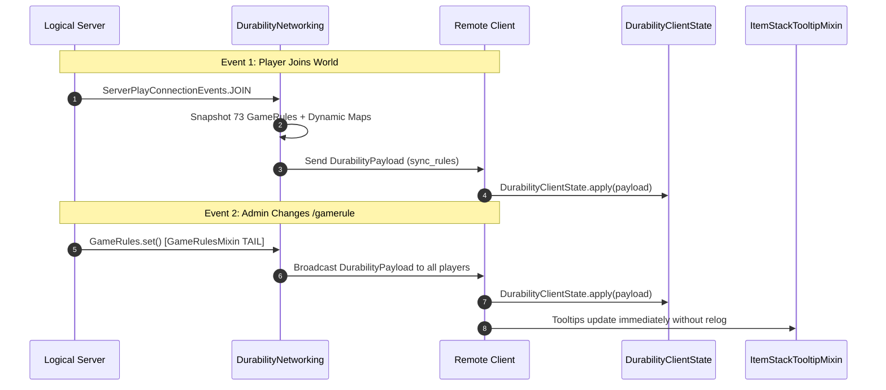

# 網路同步與負載協定 (26.1.2)

| 協议參數 | 取值 |
| :--- | :--- |
| **信道標識符** | `durability-multiplier:sync_rules` |
| **負載數據封包類** | `net.instantgratification.durabilitymultiplier.network.DurabilityPayload` |
| **網絡管理器** | `net.instantgratification.durabilitymultiplier.network.DurabilityNetworking` |
| **客戶端状態缓存** | `net.instantgratification.durabilitymultiplier.network.DurabilityClientState` |
| **编解碼器類型** | `StreamCodec<FriendlyByteBuf, DurabilityPayload>` |
| **同步触發時機** | 玩家加入 (`ServerPlayConnectionEvents.JOIN`) 与游戏規則修改 (`GameRulesMixin`) |

---

## ⚡ 協定架構

由于物品提示框在物理客戶端渲染，而游戏規則存在于逻辑服务端，Durability Multiplier 使用 Fabric Networking API 将全部 73 項靜態游戏規則以及動態模組物品規則的實時快照推送给客戶端。



---

## 📦 負載封包架構（76 個欄位與動態映射表）

`DurabilityPayload` 使用 `FriendlyByteBuf` 的 VarInt、Boolean 及 Map 编解碼器高效序列化所有游戏規則与動態映射表：

```java
public record DurabilityPayload(
    int percentGlobal,
    int percentWeapons,
    int percentSwords,
    int percentSpears,
    int percentTridents,
    int percentMaces,
    int percentBows,
    int percentCrossbows,
    int percentShields,
    int percentTools,
    int percentPickaxes,
    int percentAxes,
    int percentShovels,
    int percentHoes,
    int percentShears,
    int percentFishingRods,
    int percentBrushes,
    int percentFlintAndSteel,
    int percentArmor,
    int percentHelmets,
    int percentChestplates,
    int percentLeggings,
    int percentBoots,
    int percentElytra,
    
    boolean infinityGlobal,
    boolean infinityWeapons,
    boolean infinitySwords,
    boolean infinitySpears,
    boolean infinityTridents,
    boolean infinityMaces,
    boolean infinityBows,
    boolean infinityCrossbows,
    boolean infinityShields,
    boolean infinityTools,
    boolean infinityPickaxes,
    boolean infinityAxes,
    boolean infinityShovels,
    boolean infinityHoes,
    boolean infinityShears,
    boolean infinityFishingRods,
    boolean infinityBrushes,
    boolean infinityFlintAndSteel,
    boolean infinityArmor,
    boolean infinityHelmets,
    boolean infinityChestplates,
    boolean infinityLeggings,
    boolean infinityBoots,
    boolean infinityElytra,
    
    boolean singleUseGlobal,
    boolean singleUseWeapons,
    boolean singleUseSwords,
    boolean singleUseSpears,
    boolean singleUseTridents,
    boolean singleUseMaces,
    boolean singleUseBows,
    boolean singleUseCrossbows,
    boolean singleUseShields,
    boolean singleUseTools,
    boolean singleUsePickaxes,
    boolean singleUseAxes,
    boolean singleUseShovels,
    boolean singleUseHoes,
    boolean singleUseShears,
    boolean singleUseFishingRods,
    boolean singleUseBrushes,
    boolean singleUseFlintAndSteel,
    boolean singleUseArmor,
    boolean singleUseHelmets,
    boolean singleUseChestplates,
    boolean singleUseLeggings,
    boolean singleUseBoots,
    boolean singleUseElytra,

    boolean showTooltip,
    
    java.util.Map<String, Integer> dynamicPercentages,
    java.util.Map<String, Boolean> dynamicInfinities,
    java.util.Map<String, Boolean> dynamicSingleUses
) implements CustomPacketPayload
```
