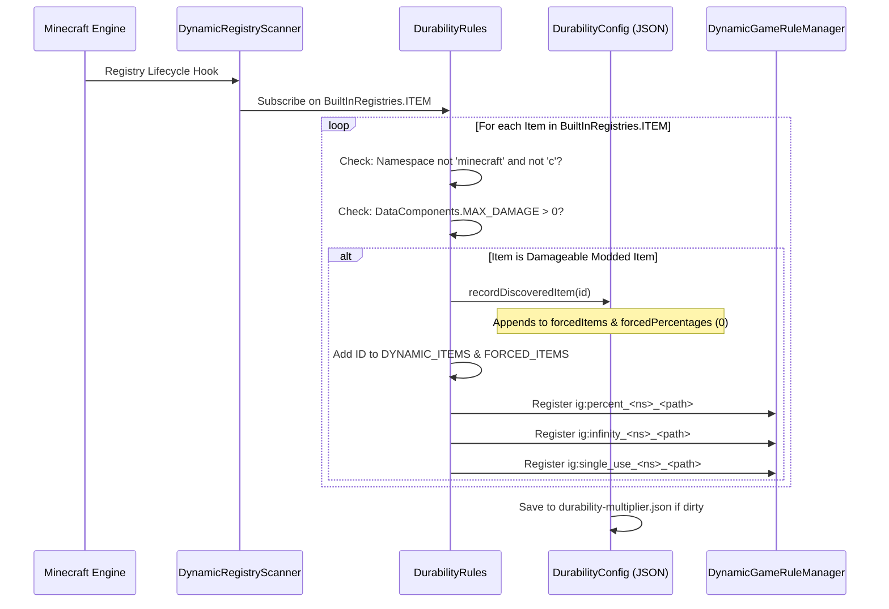

# 動態模組物品註冊 (26.2)

| 系统參數 | 取值 |
| :--- | :--- |
| **扫描引擎** | `DynamicRegistryScanner.subscribe(BuiltInRegistries.ITEM, ...)` |
| **耐久判定條件** | `DataComponents.MAX_DAMAGE > 0` 或存在于 `forcedItems` 列表中 |
| **忽略的命名空间** | `minecraft`, `c`（已通过原版与通用規范分類处理） |
| **動態注册列表** | `DurabilityRules.DYNAMIC_ITEMS` 与 `DurabilityRules.FORCED_ITEMS` |
| **生成的百分比規則** | `ig:percent_<namespace>_<path>` (下限 `-1`, 默认 `0`) |
| **生成的上帝模式規則** | `ig:infinity_<namespace>_<path>` (默认 `false`) |
| **生成的單次使用規則** | `ig:single_use_<namespace>_<path>` (默认 `false`) |
| **自動填充目標** | `config/durability-multiplier.json` 中的 `forcedItems` 列表与 `forcedPercentages` 映射表 |

---

## ⚡ 概述與設計目的

许多 Minecraft 模組引入了自定义武器、魔法法杖、能量工具或機械設備，它们**并未**繼承原版標准物品類 (`SwordItem`, `PickaxeItem`)，也未挂載原版物品標籤 (`#minecraft:swords`)。

Durability Multiplier 通过自主的**動態物品注册与自動填充引擎**彻底解决了這一難題。任何可損耗的模組物品都会被自動检測，注册進游戏内拥有完整 Tab 补全的 GameRule 系统，并在啟動時直接寫入 `config/durability-multiplier.json`。

---

## 🔧 通用 3 級探索掃描器

本模組實现了 3 級扫描生命周期，無论外部模組何時注册其物品，均能確保 100% 發现識别：



### 1. 第 1 級：啟動掃描
在模組初始化阶段 (`DurabilityRules.register()`)，引擎立即扫描 `config/durability-multiplier.json` 中顯式聲明的所有物品并注册其動態游戏規則。

### 2. 第 2 級：動態註冊訂閱
模組通过 `DynamicRegistryScanner` 订阅 `BuiltInRegistries.ITEM`。每当外部模組注册新物品時，回調即刻检查该物品：
* 若物品命名空间非 `minecraft` 或 `c`，且具備 `DataComponents.MAX_DAMAGE > 0`，則被標记為已發现。
* 该物品被记錄至 `forcedItems` 和 `forcedPercentages` 中（默认 `0`）。
* 即時動態创建专屬游戏規則。

### 3. 第 3 級：伺服器啟動兜底掃描
当世界加載或服务器啟動時，最后一轮安全兜底扫描可確保捕获并同步由數據封包或迟加載模組注册的物品。

---

## 📖 逐步操作指南

### 操作指南 1：在遊戲內透過 `/gamerule` 指令設定模組物品

每个被發现的模組物品均获得三項专屬游戏規則：
1. `ig:percent_<namespace>_<path>`: 設置耐久百分比 (`100` = 1x 原版, `200` = 2x, `50` = 0.5x, `0` = 繼承父分類/全局, `-1` = 單次使用)。
2. `ig:infinity_<namespace>_<path>`: 切換無法破壞的上帝模式 (`true` / `false`)。
3. `ig:single_use_<namespace>_<path>`: 切換 1 次命中破碎的玻璃模式 (`true` / `false`)。

#### 範例指令：
```mcfunction
# 1. Query the current percentage for a custom plasma cutter
/gamerule ig:percent_techmod_plasma_cutter

# 2. Give the plasma cutter 500% (5x) durability in the active world
/gamerule ig:percent_techmod_plasma_cutter 500

# 3. Make a magic wand completely unbreakable (God Mode)
/gamerule ig:infinity_magicmod_staff_of_fire true

# 4. Make an obsidian dagger break after a single use (Glass Mode)
/gamerule ig:single_use_customweapons_obsidian_dagger true

# 5. Reset the plasma cutter to inherit global/category settings
/gamerule ig:percent_techmod_plasma_cutter 0
```

> 💡 **即時 Tab 补全**：输入 `/gamerule ig:percent_` 或 `/gamerule ig:infinity_` 并按下 `Tab` 键，即可立即看到所有發现的模組物品自動补全！

---

### 操作指南 2：在 `durability-multiplier.json` 中預先設定模組物品

对于制作分發整合封包的作者或為主機所有未来世界預設默认值的服主：

1. 安裝所有模組后啟動一次游戏，使自動填充引擎完整扫描所有物品。
2. 在任意文本编辑器中打開 `config/durability-multiplier.json`。
3. 定位 `forcedPercentages`、`forcedInfinities` 或 `forcedSingleUses` 映射表。
4. 填入期望的預設數值：

```json
{
  "configVersion": 2,
  "percentGlobal": 200,
  
  "forcedItems": [
    "techmod:plasma_cutter",
    "magicmod:staff_of_fire",
    "survivalmod:flint_knife"
  ],
  
  "forcedPercentages": {
    "techmod:plasma_cutter": 400,
    "survivalmod:flint_knife": 50
  },
  
  "forcedInfinities": {
    "magicmod:staff_of_fire": true
  },
  
  "forcedSingleUses": {}
}
```

5. 保存文件。任何新建的單人世界或全新创建的服务器都将采用這些基线默认值。

---

### 操作指南 3：使用進階使用者 `-1` 玻璃模式哨兵值

除了切換布尔型的 `ig:single_use_<mod>_<item>` 規則，你也可以直接在任何百分比規則上填入 `-1`：

```mcfunction
# Set the plasma cutter to 1-hit break mode using the percentage rule
/gamerule ig:percent_techmod_plasma_cutter -1
```

* **工作原理**: 判定引擎检查 `getEffectivePercent(...) <= -1`。若為 true，`isSingleUse(...)` 立即返回 `true`。
* **优势**: 允许直接從數值配置输入框或滑块界面設置單次使用機制。

