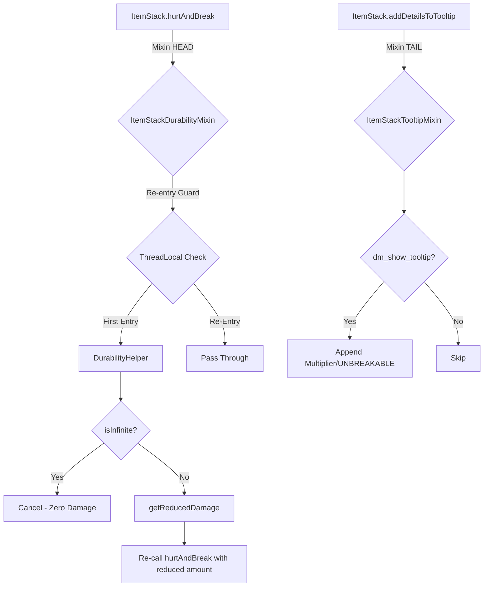

# Durability Multiplier Architecture

## System Overview



## Module Responsibilities

### DurabilityRules

Registry of 11 GameRules + custom `GameRuleCategory`. Mirrors the vanilla `GameRules.registerBoolean`/`registerInteger` pattern using `Registry.register(BuiltInRegistries.GAME_RULE, ...)`.

**Access Pattern**:

```java
DurabilityRules.getBoolean(level, DurabilityRules.DM_INFINITY_GLOBAL);
DurabilityRules.getInt(level, DurabilityRules.DM_MULTIPLIER_GLOBAL);
```

Server-side only — returns safe defaults (`false`/`0`) on client.

### DurabilityHelper

Stateless utility class. All methods are `static`. Core logic:

| Method | Purpose |
| :--- | :--- |
| `classifyItem(ItemStack)` | Categorizes item via `ItemTags` |
| `isInfinite(ServerLevel, ItemStack)` | Hierarchy: tag-specific → global |
| `getEffectiveMultiplier(ServerLevel, ItemStack)` | Hierarchy: tag-specific (if >0) → global |
| `getReducedDamage(ServerLevel, ItemStack, int)` | `amount / multiplier` with probabilistic rounding |

### Mixins

| Mixin | Target | Injection | Purpose |
| :--- | :--- | :--- | :--- |
| `ItemStackDurabilityMixin` | `ItemStack.hurtAndBreak` | `@Inject HEAD` | Cancel (infinity) or reduce damage |
| `ItemStackTooltipMixin` | `ItemStack.addDetailsToTooltip` | `@Inject TAIL` | Append durability status to tooltip |

## Design Decisions

### Why Damage Reduction, Not Max Override?

`ItemStack.getMaxDamage()` is called client-side without `Level` context. We cannot read GameRules without a `ServerLevel`. Instead, we reduce incoming damage in `hurtAndBreak()` (server-side only), which is mathematically equivalent:

- **2x multiplier** → items take **half** damage → last **2x longer**
- **4x multiplier** → items take **quarter** damage → last **4x longer**

### Why ThreadLocal Re-entry Guard?

The durability mixin cancels the original `hurtAndBreak` call and re-calls it with reduced damage. Without a guard, this re-call would trigger the mixin again → infinite recursion. `ThreadLocal<Boolean>` prevents this cleanly.

### Why Probabilistic Rounding?

Integer division truncates: `1 / 3 = 0`. This means a 3x multiplier on 1-point damage would make items truly unbreakable (unintended). Probabilistic rounding gives a `1/3` chance of taking 1 damage, achieving exact long-term durability.
